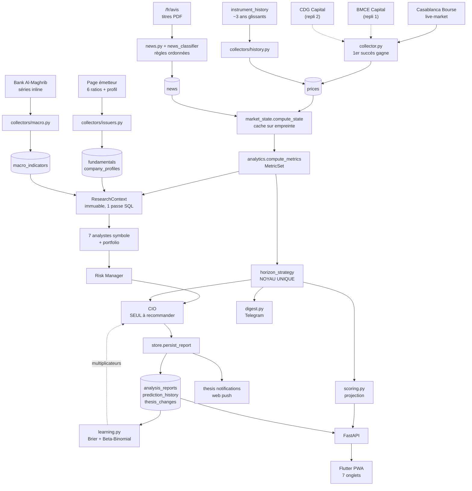
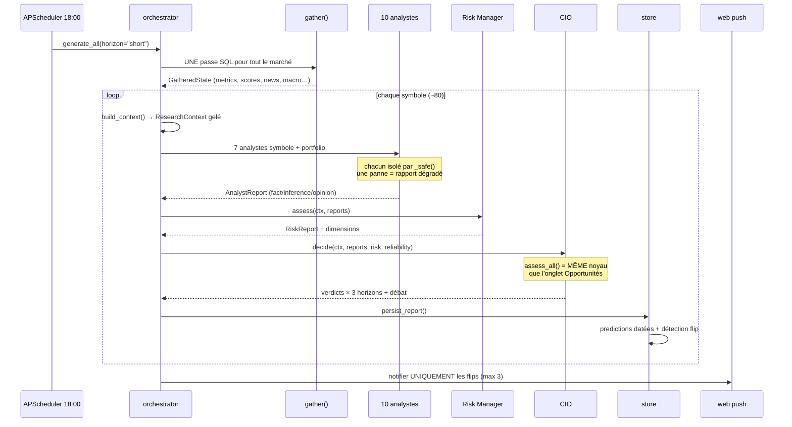
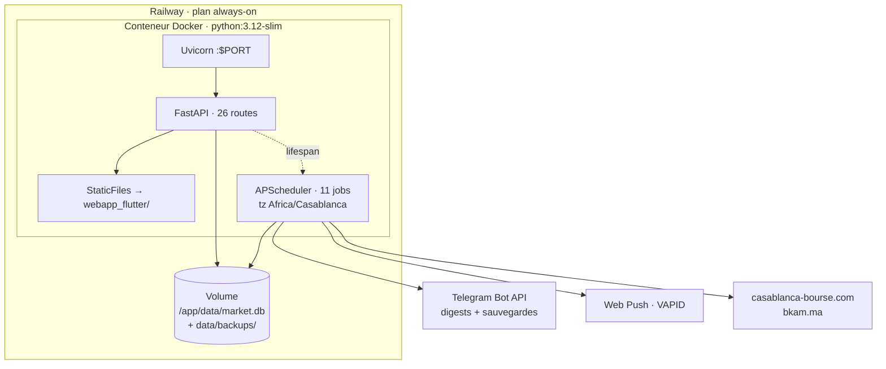

# Audit technique — Moroccan Stock Intelligence Platform

> **Audit indépendant. Le code exécuté en production est la source de vérité.**
> En cas de contradiction entre la documentation et le code, le code tranche et la contradiction est signalée.

| | |
|---|---|
| **Branche** | `main` — HEAD `9a55531` |
| **Périmètre** | Backend Python (~5 700 lignes), Flutter, scheduler, migrations, Docker, tests |
| **Tests** | 416 / 416 ✓ en 82 s (sur HEAD) |
| **Couverture** | 78 % — mesurée avec `pytest-cov`, pas estimée |
| **Date** | 18 juillet 2026 |

**Légende des niveaux de preuve** utilisée dans tout le document :

| Étiquette | Signification |
|---|---|
| `[VÉRIFIÉ CODE]` | Lu directement dans le source |
| `[VÉRIFIÉ TESTS]` | Prouvé par un test qui passe |
| `[DOC SEULEMENT]` | Affirmé dans la doc, non confirmé par le code |
| `[INFÉRENCE]` | Déduction raisonnée, non prouvée |
| `[NON VÉRIFIABLE]` | Hors de portée depuis le dépôt |
| `[DOC OBSOLÈTE]` | La doc contredit le code |

---

## Table des matières

1. [Executive summary](#1-executive-summary)
2. [Ce qu'est réellement le projet](#2-ce-quest-réellement-le-projet)
3. [Architecture globale](#3-architecture-globale)
4. [Sources de données](#4-sources-de-données)
5. [Pipeline de collecte](#5-pipeline-de-collecte)
6. [Moteurs de calcul](#6-moteurs-de-calcul)
7. [Système multi-agents](#7-système-multi-agents)
8. [Analyse du portefeuille](#8-analyse-du-portefeuille)
9. [Learning engine](#9-learning-engine)
10. [LLM et anti-hallucination](#10-llm-et-anti-hallucination)
11. [API](#11-api)
12. [Frontend Flutter](#12-frontend-flutter)
13. [Notifications](#13-notifications)
14. [Infrastructure et déploiement](#14-infrastructure-et-déploiement)
15. [Base de données](#15-base-de-données)
16. [Sécurité](#16-sécurité)
17. [Tests et qualité](#17-tests-et-qualité)
18. [État réel des fonctionnalités](#18-état-réel-des-fonctionnalités)
19. [Dette technique et incohérences](#19-dette-technique-et-incohérences)
20. [Roadmap priorisée](#20-roadmap-priorisée)
21. [Glossaire](#21-glossaire)
22. [Évaluation, conclusion et 15 questions](#22-évaluation-conclusion-et-15-questions)

---

## 1. Executive summary

Ce projet est **un moteur d'analyse quantitative déterministe** pour la Bourse de Casablanca, habillé d'une couche multi-agents explicative et livré comme une PWA personnelle mono-utilisateur. Il ne passe aucun ordre de bourse et n'en a ni le code ni l'intention.

La qualité d'ingénierie est nettement au-dessus de ce qu'on attend d'un projet personnel : 416 tests qui passent en 82 secondes, 78 % de couverture réellement mesurée, Alembic en place, sauvegardes vérifiées et expédiées hors-hôte, et un principe « ne jamais fabriquer une donnée » appliqué avec une discipline rare — les métriques manquantes réduisent la couverture et plafonnent la confiance au lieu d'être remplacées par un 50 arbitraire.

Trois constats dominent l'audit, et deux d'entre eux **contredisent l'énoncé de départ**.

### 🔴 1. La production n'a aucune authentification — et le correctif n'est pas déployable en l'état

Le HEAD déployé sert *vos positions réelles, vos prix d'achat et votre P/L* à quiconque connaît l'URL. Une couche d'auth complète et bien conçue existe dans l'arbre de travail, mais elle est **non commitée**, elle **casse 45 tests**, et le bundle Flutter compilé (`webapp_flutter/`) **ne contient aucun écran de login**. Commiter et déployer en l'état rendrait l'application inutilisable : chaque appel API répondrait 401 sans que l'interface sache demander un mot de passe.

### 🔵 2. Plusieurs risques de votre énoncé sont déjà corrigés

Il n'existe **aucun workflow GitHub Actions** — le dossier `.github/` a été supprimé en `cf7aed9`, ce qui élimine le double scheduler, le double chemin Telegram et la base SQLite divergente. Les **deux moteurs de scoring concurrents ont convergé** en `6a208b2` : `scoring.py` est désormais une projection du noyau `horizon_strategy`. Auditer ces points comme « à corriger » serait faux.

### 🟠 3. L'intelligence produite dépasse largement ce qui est restitué

Le backend calcule une note de recherche rédigée, un historique de thèses, des dimensions de risque détaillées et une performance par analyste. La **narration n'est jamais affichée** (aucun appel à `/api/report/{symbol}/narrative` dans le frontend), les **dimensions de risque n'entrent pas dans le score de risque**, et les **fondamentaux collectés ne pèsent pas sur le score long terme**. Du calcul est écrit puis jamais relu.

> **Verdict de maturité :** une **application personnelle fonctionnelle et sérieuse**, en cours de transition vers un MVP multi-utilisateur. Ce n'est pas un prototype — c'est déployé, testé et utilisé quotidiennement. Ce n'est pas non plus une plateforme professionnelle : il manque l'authentification en production, des fondamentaux branchés sur le scoring, un indice officiel, et un backtest qui valide que les scores prédisent quoi que ce soit.

---

## 2. Ce qu'est réellement le projet

### Le problème résolu

La Bourse de Casablanca publie des cours différés d'environ 15 minutes et des avis officiels en PDF, mais aucun outil grand public n'agrège cela en un suivi quotidien, explicable et personnalisé. Un particulier détenant une poignée de valeurs marocaines n'a ni screener, ni alerte, ni suivi de P/L net de frais. Ce projet comble ce vide **pour une seule personne : son propriétaire.**

### Utilisateur cible

Un investisseur particulier unique. Ce n'est pas une inférence : `config.py` documente `auth_password` comme « single owner », `Favorite` et le portefeuille n'ont aucune notion de `user_id`, et le throttle d'authentification est en mémoire, mono-conteneur. Le mono-utilisateur est une décision d'architecture, pas un oubli. `[VÉRIFIÉ CODE]`

### Nature du système

C'est une **combinaison**, avec un centre de gravité clair :

- **Moteur quantitatif déterministe** — le cœur. Momentum, moyennes mobiles, volatilité, support/résistance, scoring 0-100 par horizon.
- **Screener** — l'onglet Opportunités classe 80 valeurs par `buy_score`.
- **Système d'alertes** — digests Telegram, web push, inbox intégrée.
- **Système multi-agents** — 10 analystes déterministes qui produisent des rapports JSON structurés, arbitrés par un CIO. *Aucun n'est un agent LLM.*

### Ce que le projet ne fait pas

- **Aucun passage d'ordre.** Aucun code de courtage, aucune clé API broker, aucune notion d'ordre. `[VÉRIFIÉ CODE]`
- Aucune prévision de prix futur — les sorties sont des scores et des directions probabilistes.
- Aucun temps réel — cours différés ~15 min, collecte toutes les 2 h.
- Aucune analyse de bilan (les états financiers ne sont pas publiés en format exploitable).
- Aucun backtest : rien ne prouve aujourd'hui que les scores prédisent les rendements.

### Description en une phrase

> Une plateforme personnelle qui collecte quotidiennement les cours et avis officiels de la Bourse de Casablanca, les transforme en scores explicables par horizon via un comité d'analystes déterministes, et notifie son unique propriétaire quand la thèse d'investissement d'une valeur change.

### En un paragraphe

Un conteneur Docker unique sur Railway exécute FastAPI, un scheduler APScheduler et une PWA Flutter compilée, adossés à une base SQLite sur volume persistant. Le scheduler scrape la Bourse de Casablanca (avec repli sur BMCE Capital puis CDG Capital), les avis officiels, les six ratios publiés par émetteur et les séries de Bank Al-Maghrib. Un noyau de scoring unique évalue chaque valeur sur trois horizons en ne pondérant que les indicateurs réellement disponibles : une métrique manquante abaisse la couverture, ramène le score vers le neutre et plafonne la confiance. Dix analystes lisent un contexte partagé immuable et émettent des rapports structurés distinguant `fact`, `inference` et `opinion` ; un Risk Manager agrège, un CIO tranche — seul module autorisé à recommander. Les rapports sont persistés, leurs prédictions datées et évaluées plus tard par un moteur de calibration bayésienne. Un LLM optionnel, désactivé par défaut, ne peut que reformuler, jamais décider.

### Présentation technique

La colonne vertébrale est `services/horizon_strategy.py` : trois modèles pondérés (court / moyen / long) opérant sur un `MetricSet` immuable produit par `services/analytics.py` à partir de `pandas`. `services/scoring.py`, historiquement un second moteur concurrent, a été réduit à une projection de ce noyau — `buy_score` est le score court terme, `avoid_score` le score de risque. `services/research/` ajoute la couche institutionnelle : `context.py` construit un `ResearchContext` gelé (une seule passe SQL par exécution), `orchestrator.py` exécute les analystes avec isolation des pannes, `debate.py` matérialise les désaccords, `learning.py` note les prédictions arrivées à échéance via un score de Brier et une postérieure Beta-Binomiale. `market_state.py` mémoïse tout le calcul sur une empreinte des *entrées* (max id des prix + triplet news), pas sur un TTL — un cache qui ne peut structurellement pas servir une donnée périmée.

---

## 3. Architecture globale

### Flux réel

### Séquence d'une analyse complète

### Composants

| Composant | Fichier | Entrées → Sorties | État |
|---|---|---|---|
| Frontend | `flutter_app/lib/main.dart` (2 249 l.) | JSON API → 7 onglets | ✅ Opérationnel |
| Bundle déployé | `webapp_flutter/` | Build committé, servi par StaticFiles | ⚠️ Désynchronisé |
| Backend API | `api.py` (525 l.) | HTTP → 26 routes | ✅ Opérationnel |
| Base | `models.py` — 16 tables | SQLite sur volume | ✅ Opérationnel |
| Scheduler | `scheduler.py` (434 l.) | 11 jobs APScheduler | ✅ Opérationnel |
| Scrapers cours | `scrapers/` ×3 | HTML → `StockSnapshot` | ✅ Opérationnel |
| Collecteurs 1b | `collectors/` ×7 | JSON:API → feeds | ⚠️ Non couverts par tests |
| Noyau scoring | `horizon_strategy.py` | `MetricSet` → 3 scores | ✅ Opérationnel |
| Multi-agents | `analysts/` ×10 | `ResearchContext` → rapports | ⚠️ 4/10 sans données |
| Learning | `research/learning.py` | prédictions → multiplicateurs | 🧪 Jamais mûri |
| Synthèse LLM | `synthesis/claude.py` | rapport → prose | ❌ Désactivé, 0 % testé |
| Notifications | `telegram.py`, `push.py` | digests + thèses | ✅ Opérationnel |
| Déploiement | `Dockerfile`, Railway | Conteneur unique | ✅ Opérationnel |
| Dashboard Streamlit | — | — | ❌ Supprimé (`468d8cd`) |

### Technologies

| Couche | Techno | Utilisation exacte | Justification | Limites |
|---|---|---|---|---|
| Langage | Python 3.12 | Tout le backend | Écosystème data mature | GIL — non bloquant ici |
| API | FastAPI 0.115 | 26 routes + StaticFiles | Async, validation, léger | Routes majoritairement sync |
| ORM | SQLAlchemy 2.0 | Modèles typés `Mapped[]` | Portable SQLite↔PG | Requêtes lourdes en Python |
| Base | SQLite (PG possible) | `data/market.db` sur volume | Zéro infra, un utilisateur | Un seul writer, pas de réplication |
| Calcul | pandas 2.2 + numpy | `compute_metrics` resample 1D | Idiomatique séries temporelles | ~1 100 ms/appel → mis en cache |
| Scheduler | APScheduler 3.11 | 11 jobs, tz Africa/Casablanca | In-process, pas de broker | Meurt avec le conteneur |
| Migrations | Alembic 1.18 | 2 révisions, `cli migrate` | Explicite, jamais au boot | Application manuelle |
| Frontend | Flutter Web / Dart | Un seul fichier de 2 249 lignes | PWA installable, un codebase | Pas de modèles typés, bundle lourd |
| Scraping | BeautifulSoup + requests | 3 scrapers + JSON:API | Suffisant pour du HTML statique | Fragile aux refontes |
| Push | pywebpush + VAPID | Notifications navigateur | Standard, sans service tiers | iOS exige la PWA installée |
| Telegram | Bot API | Digests + sauvegardes | Gratuit, déjà en place | Limite d'upload ~50 Mo |
| LLM | Anthropic (optionnel) | `LLM_PROVIDER=none` par défaut | Le SDK n'est même pas installé | 0 % de couverture de test |

#### Pourquoi un conteneur unique et SQLite

C'est une contrainte explicite du projet — « no new infrastructure » revient dans plusieurs docstrings. Pour un utilisateur, ~80 symboles et une base de 700 Ko, PostgreSQL ajouterait un service à gérer, un coût mensuel et un mode de panne, sans rien résoudre. La conception *anticipe* la migration : `psycopg` est déjà dans `requirements.txt`, Alembic est en place, un test prouve le chemin PostgreSQL, et `cli copy-database` existe. Le choix est réversible, ce qui est ce qui le rend défendable. `[VÉRIFIÉ CODE]` `[VÉRIFIÉ TESTS]`

---

## 4. Sources de données

| Source | Données | Méthode | Fréquence | Repli | Fiabilité | Risque |
|---|---|---|---|---|---|---|
| `casablanca-bourse.com/fr/live-market` | Cours, variation, volume, capi, haut/bas | BeautifulSoup, tables par secteur | ×5/jour ouvré + ouverture app | BMCE → CDG | Haute (officielle) | Refonte HTML |
| `bmcecapitalbourse.com` | Cours, variation, volume | Scraping tables 4 colonnes | Seulement si source 1 échoue | CDG | Moyenne — **symboles devinés** | Alias codés en dur |
| `cdgcapitalbourse.ma` | Cours minimal | Scraping générique | Dernier recours | aucun | Faible — `company_name = symbol` | 37 % de couverture |
| `/fr/avis` | **Titres** des avis officiels | Liens `<a>` + classification | 2×/jour (digests) | aucun | Haute sur le titre | **PDF jamais lus** |
| Page émetteur | BPA, ROE, Payout, rendement, PER, PBR + profil | `issuer_page.py` | Hebdo (dim. 03:00) | aucun | Haute (officielle) | **0 % testé** |
| Bank Al-Maghrib | Taux directeur, TMP, inflation, EUR/USD | Parsing inline de la home | Quotidien 07:30 | aucun | Haute | Pétrole/phosphate absents |
| `instrument_history` (JSON:API) | ~738 séances OHLC ajustées | API Drupal non documentée | Une fois au boot, auto-réparateur | aucun | Haute | **Non documentée, 3 ans glissants** |
| `PORTFOLIO_JSON` | Quantités + prix d'achat | Variable d'environnement | Manuel | fichier | Saisie utilisateur | Aucune validation métier |

### Distinction rigoureuse

**Réellement collecté** — Cours et volumes (80 symboles), historique ~3 ans, titres d'avis classifiés, six ratios par émetteur, profil société, six séries BAM.

**Utilisé comme proxy — MASI / MSI20.** Il n'existe aucun flux d'indice officiel. `context.py:396` construit `msi20_proxy` comme la *moyenne équipondérée* du momentum des valeurs suivies. C'est honnêtement étiqueté — `market_structure.py:37` affiche « Proxy d'indice équipondéré (pas de flux MASI/MSI20 officiel) : lecture indicative ». Mais un MASI réel est pondéré par la capitalisation flottante : sur un marché où Attijariwafa, IAM et BCP dominent, un proxy équipondéré peut diverger fortement de l'indice réel. Toute « performance relative » et le régime de marché en héritent. `[VÉRIFIÉ CODE]`

**Déclaré mais absent en base** — Sur la base locale : `fundamentals` = 0, `company_profiles` = 0, `macro_indicators` = 0, `company_knowledge` = 0. Les analystes Fundamental, Company et Macro y retournent tous « données non collectées ». Les jobs existent (dim. 03:00, quot. 07:30) et un bootstrap au boot les amorce si vide, donc la production est probablement mieux pourvue — mais je n'ai pas pu le vérifier. `[INFÉRENCE]`

**Jamais collecté** — Chiffre d'affaires, résultat net, marges, ROA, dette/fonds propres, actif net comptable. Le corps des PDF d'avis. Le carnet d'ordres, les données intraday tick. Pétrole et phosphate. Tous sont nommés dans `missing_data` plutôt que devinés — c'est la bonne pratique appliquée.

> ⚠️ **Les PDF ne sont jamais lus.** `news.py:parse_official_news` classe `link.get_text()` — le libellé du lien. Le PDF derrière n'est jamais téléchargé. Toute la taxonomie d'événements repose donc sur une phrase. C'est cohérent avec le fait que les avis sont procéduraux, mais cela signifie qu'un avertissement sur résultat dont le titre serait neutre passerait inaperçu. `[VÉRIFIÉ CODE]`

---

## 5. Pipeline de collecte

### Chemin exact

1. **Déclenchement** — cron APScheduler, ou `POST /api/refresh` à l'ouverture de l'app (silencieux, cooldown 900 s, single-flight), ou `POST /api/run-now` (qui notifie).
2. **Appel des sources** — `collect_market_snapshots()` essaie les 3 scrapers dans l'ordre ; **le premier succès gagne**, les autres ne sont jamais appelés.
3. **Parsing** — BeautifulSoup ; `parse_number` gère les séparateurs français, les suffixes K/M/B et rend `None` sur `"-"`.
4. **Normalisation** — `StockSnapshot` gelé ; `observed_at` = instant de collecte (pas date de séance).
5. **Déduplication** — `deduplicate_snapshots` garde, par `(source, symbol)`, la ligne au plus grand nombre de champs non nuls.
6. **Persistance** — `store_snapshot` ; contrainte `uq_price_snapshot (stock_id, observed_at, source)`.
7. **Calcul** — `compute_state`, mémoïsé sur l'empreinte des entrées.
8. **Analyse** — noyau horizon, puis (à 18:00) les 10 analystes.
9. **Notification** — digest Telegram + push ; ou push de changement de thèse uniquement.

### Jobs du scheduler

| Job | Horaire réel | Jours | Action | Tables écrites | Notifie ? |
|---|---|---|---|---|---|
| `bootstrap` | boot + 8 s | — | Seed si `prices` vide | prices, stocks, news | Non |
| `feeds_bootstrap` | boot + 90 s | — | Seed macro/émetteurs si vide | macro, fundamentals, profiles | Non |
| `history_bootstrap` | boot + 180 s | — | Backfill ~3 ans, auto-réparateur | prices | Non |
| `learning_cycle` | 06:00 | Tous | Noter + recalibrer | prediction_history, analyst_performance | Non |
| `macro_collect` | 07:30 | Lun-Ven | Bank Al-Maghrib | macro_indicators | Non |
| `morning_digest` | **09:00** | Lun-Ven | Collecte + news + analyse | prices, news, notifications | **Telegram + push** |
| `intraday_update` | **11:00 / 13:00 / 15:00** | Lun-Ven | Collecte légère + filet crash | prices, alerts, notifications | **Telegram + push** |
| `closing_digest` | **17:00** | Lun-Ven | Idem matin | prices, news, notifications | **Telegram + push** |
| `research_reports` | 18:00 | Lun-Ven | Rapports 10 analystes ×80 | analysis_reports, predictions, thesis_changes | Push si thèse change (max 3) |
| `database_backup` | 22:00 | Tous | Snapshot + envoi Telegram | — | Telegram si échec |
| `knowledge_harvest` | dim. 04:30 | Dim | Faits dédupliqués | company_knowledge | Non |
| `issuer_collect` | dim. 03:00 | Dim | ~80 fetchs séquentiels | fundamentals, company_profiles | Non |

### Divergences d'horaires

| Endroit | Annonce | Réel | Statut |
|---|---|---|---|
| `scheduler.py` | 09:00 / 11:00 / 13:00 / 15:00 / 17:00 | Identique | ✅ Source de vérité |
| `README.md` l. 209-219 | Tableau complet et exact | Identique | ✅ Correct |
| `README.md` **l. 15** | « deux digests à **10:00 et 16:00** » | 09:00 / 17:00 | ❌ Obsolète |
| `README.md` **l. 18** | « intraday à **12:00 et 14:00** » | 11:00 / 13:00 / 15:00 | ❌ Obsolète |
| `render.yaml` (commentaire) | « 10:00/12:00/14:00/16:00 » | — | ❌ Obsolète |
| GitHub Actions | — | **N'existe plus** | ✅ Supprimé en `cf7aed9` |

Le README se contredit donc lui-même : son introduction annonce les anciens horaires de GitHub Actions, son tableau de référence annonce les bons. `[DOC OBSOLÈTE]`

---

## 6. Moteurs de calcul

### Indicateurs techniques — ce qui existe vraiment

| Métrique | Formule réelle (`analytics.py`) | Si données insuffisantes | État |
|---|---|---|---|
| Momentum 1/5/30/90 j | `_momentum()` : `searchsorted` sur le temps en ns, puis `(p[-1]-p[i-1])/p[i-1]×100` | `None` si aucune séance assez ancienne | ✅ Correct |
| MM20 / MM50 / MM200 | `prices.tail(n).mean()` | **Renvoie une moyenne quand même** | ⚠️ Défaut |
| Volatilité 30 j | `returns.tail(30).std() × √252 × 100` | `None` si < 3 points | ⚠️ Voir ci-dessous |
| Anomalie de volume | `volume / moyenne20(volumes ≠ 0)` | `None` | ✅ Correct |
| Support / Résistance | `min/max` des 90 dernières lignes | support = résistance (signalé) | ⚠️ Naïf |
| Drawdown | `pct_distance(price, resistance)` | `None` | ⚠️ Doublon |
| 52 semaines | `min/max` des 365 dernières lignes | `None` | ✅ Correct |
| Force sectorielle | Moyenne du momentum 30 j du secteur | `None` | ✅ Correct |
| Performance relative | `momentum_30d − moyenne du marché` | `None` | ⚠️ Proxy équipondéré |
| Breadth | % des valeurs au-dessus de leur MM50 | `None` | ✅ Correct |
| **RSI** | — | — | ❌ Non implémenté |
| **MACD** | — | — | ❌ Non implémenté |
| **Bollinger** | — | — | ❌ Non implémenté |
| **Chandeliers** | — | — | ❌ Non implémenté |

> ⚠️ **Défaut réel : les moyennes mobiles ne vérifient jamais la profondeur.**
>
> `analytics.py:120-122` calcule `prices.tail(200).mean()`. Avec 10 séances en base, `tail(200)` renvoie 10 lignes et `ma200` vaut la moyenne de 10 jours — **étiquetée MM200**. Elle n'est jamais `None`, donc tous les consommateurs la croient disponible : `assess_medium` compte « cours > MM50 » comme une condition remplie, `_trend()` classe la valeur en haussier/baissier, et `market_context.breadth_above_ma50_pct` agrège des MM50 fictives à l'échelle du marché.
>
> Le noyau est par ailleurs scrupuleux sur les données manquantes ; c'est précisément ce qui rend cette exception dangereuse — elle contourne silencieusement le mécanisme de couverture.
>
> *Atténuation :* le backfill de ~3 ans amène ~738 séances, donc en production le problème ne se pose que sur un symbole nouvellement introduit ou dont le backfill a échoué. La même remarque vaut pour `volatility_30d`, calculable dès 3 points. `[VÉRIFIÉ CODE]`

### Le moteur de scoring — un seul, désormais

Votre énoncé suppose « plusieurs moteurs concurrents ». **C'était vrai, ça ne l'est plus.** Le commit `6a208b2` a fait converger `scoring.py` sur le noyau `horizon_strategy`, après une comparaison chiffrée documentée dans le module : 89 % de divergence sur 71 des 80 symboles, et des labels dégénérés (80/80 « SURVEILLER »). `[VÉRIFIÉ CODE]`

#### Formules exactes

| Score | Formule |
|---|---|
| **court** | `0,30 momentum(1j×0,4 + 5j×0,6) + 0,20 volume + 0,20 cassure + 0,15 support + 0,15 actus`, − 6 pts si variation du jour > +4 % |
| **moyen** | `0,35 tendance(30j×0,6 + 90j×0,4) + 0,25 moyennes mobiles + 0,15 secteur + 0,15 volatilité inverse + 0,10 actus` |
| **long** | `0,30 tendance longue (90j ± 8 si MM200 fiable ≥ 180 j) + 0,30 stabilité + 0,20 structure 52 s + 0,10 secteur + 0,10 événements` |
| **agrégation** | `score = Σ(vᵢ·wᵢ) / Σwᵢ` sur les *seuls* composants disponibles, puis `50 + (score−50) × min(1, couverture/0,8)` |
| **risque** | volatilité + momentum négatif + drawdown + volume de baisse + actus négatives + historique court, borné 0-100 |
| **confiance** | `50×couverture + 30×min(historique/cible, 1) + 20×cohérence`, plafonnée à 35 si couverture < 50 %. Cibles 30/90/250 j |
| `buy_score` | = score court terme |
| `avoid_score` | = score de risque |
| `watch_score` | `clamp(buy × 0,65 + (100 − avoid) × 0,35)` |

La **rétraction vers le neutre** est le mécanisme le plus solide du projet : un score bâti sur 30 % de couverture est ramené à `50 + (score−50)×0,375`. Il devient structurellement impossible d'afficher une conviction forte sur des données pauvres.

#### Seuils de recommandation

| Condition (dans l'ordre) | Sortie |
|---|---|
| *Détenu* + avis SELL + P/L ≥ +15 % | `TAKE_PROFIT` |
| *Détenu* + avis SELL | `RISKY` |
| *Détenu* + risque ≥ 70 | `RISKY` |
| *Détenu*, sinon | `HOLD` |
| risque ≥ 65 et score < 70 | `RISKY` |
| `avoid_score` ≥ 60 | `AVOID` |
| score ≥ 70 et confiance ≥ 50 | `STRONG_OPPORTUNITY` |
| score ≥ 55 | `WATCH` |
| score < 45 | `AVOID` |
| sinon | `WATCH` |

### Deux écrans peuvent-ils encore diverger ?

Oui — mais pour une raison beaucoup plus saine qu'avant, et une raison résiduelle qui est un vrai défaut.

**Divergence légitime : l'horizon.** L'onglet **Opportunités** affiche `classify_label()` sur le score *court terme*. L'onglet **Analyse** laisse choisir l'horizon et affiche le verdict du CIO pour celui-ci. Une valeur en rebond technique dans une tendance de fond dégradée sera « ACHETER » à court terme et « Éviter » à long terme. Le CIO le signale explicitement (« Les horizons divergent… »). Ce n'est pas une contradiction, c'est de l'information.

> ⚠️ **Divergence problématique : détenu vs non détenu.**
>
> Exemple concret : vous détenez **ATW**, score court 74, confiance 60, risque 45. L'onglet **Opportunités** applique `classify_label()`, qui ne connaît pas vos positions, et affiche **« ACHETER »**. L'onglet **Analyse** passe par `_recommend()`, voit `ctx.holding`, et retourne **« Conserver »**. Le même titre, le même instant, deux verbes. C'est documenté dans `scoring.py:138-141` comme une limite assumée — mais l'utilisateur, lui, voit une incohérence.

> ⚠️ **Duplication à surveiller.**
>
> `investment_analysis._recommend()` (l. 87-113) et `cio._recommend()` (l. 50-71) sont **deux implémentations distinctes de la même règle**. Elles s'accordent aujourd'hui sur toutes les constantes (65 / 60 / 70 / 50 / 55 / 45 / 70). Rien ne garantit qu'elles resteront synchronisées : modifier un seuil dans un fichier et pas l'autre ferait diverger l'onglet Analyse du rapport complet, silencieusement. Un test verrouille l'égalité des seuils entre `scoring.py` et le CIO, mais pas celle-ci. `[VÉRIFIÉ CODE]`

---

## 7. Système multi-agents

| # | Agent | Données lues | Produit | Influence réelle | État |
|---|---|---|---|---|---|
| 1 | Technical | `MetricSet` | Leans ×3, scénarios, risk_flags | Débat + risque + prix d'ancrage | ✅ Données fiables |
| 2 | Market Structure | `MarketContext` | Régime, breadth, rang secteur | Débat, narration | ⚠️ Proxy d'indice |
| 3 | Company | `CompanyProfile` | Objet social, actionnariat | Risk flags (contrôle > 50 %) | ⚠️ Vide en local |
| 4 | Fundamental | `Fundamentals` (6 ratios) | Valorisation, rentabilité | Débat + risk_flags → risque | ⚠️ Vide en local |
| 5 | News | `NewsContext`, `NewsView` | Tonalité, fraîcheur | Débat + risque + **15 % du score court** | ⚠️ Signal quasi nul |
| 6 | Historical Behaviour | `price_history` | Comportement passé | Débat, scénarios | ✅ Données fiables |
| 7 | Macro | `MacroSnapshot` | Taux, inflation, change | Contexte — **aucun lean** | ⚠️ Vide en local |
| 8 | Portfolio | `GatheredState.holdings` | Concentration sectorielle | risk_flags → risque | ⚠️ 38 % couvert |
| 9 | Risk Manager | ctx + tous les rapports | `overall_risk`, dimensions | **Entre dans la recommandation** | ✅ Opérationnel |
| 10 | CIO | Tout + fiabilité apprise | Verdicts ×3, débat, thèse | **Décide seul** | ✅ Opérationnel |

### Le ResearchContext

Construit une fois par exécution par `gather()` : une seule passe SQL charge métriques, scores, positions, profondeurs d'historique, news, fondamentaux, profils et macro. `build_context()` en dérive un `@dataclass(frozen=True)` par symbole. **Aucun analyste n'accède à la base** — j'ai vérifié : aucun des dix ne prend de `Session`, aucun n'importe `repository`. C'est ce qui rend un balayage de 80 symboles viable et rend chaque analyste testable sans base. `[VÉRIFIÉ CODE]` `[VÉRIFIÉ TESTS]`

### Isolation des pannes

`orchestrator._safe()` encapsule chaque appel ; une exception produit un `degraded_report` nommé, et le rapport continue. Le CIO reste appelé même si sept analystes ont échoué — car il ne dépend pas d'eux pour son score : il recalcule `assess_all()` sur le même noyau que l'onglet Opportunités. C'est la garantie structurelle que la recommandation ne peut pas dériver.

### fact / inference / opinion

Chaque `Statement` porte `kind`, `polarity`, `weight` et un dict `evidence`. La distinction est appliquée sérieusement : un PER calculé comme cours / BPA parce que la cellule publiée valait « - » est marqué `inference`, jamais `fact`, et signalé dans les notes. L'étiquette survit jusqu'en base via `company_knowledge.kind`.

### Débat Bull / Bear

Un échange n'est créé que sur un *vrai* désaccord : un analyste avec `lean ≥ 58` face à un autre `≤ 42` sur le même horizon. Le poids de chaque camp vaut `|lean−50|/50 × confiance/100 × fiabilité_apprise`. Sous 15 % de marge relative, l'échange est déclaré `unresolved` plutôt que de fabriquer un vainqueur. **La fiabilité apprise vaut 1,0 pour tout le monde tant qu'aucune prédiction n'a mûri** — donc aujourd'hui le débat repose sur la seule confiance déclarée, ce que le CIO annonce honnêtement dans `calibration_note`.

### Scénarios

Dérivés arithmétiquement du risque, pas d'une simulation : `p_worst = clamp(0,15 + risque/100 × 0,4)`, `p_best = clamp(0,45 − risque/100 × 0,35)`, `p_base = 1 − p_worst − p_best`. Les cibles de prix sont ancrées sur support et résistance. Ce sont des reformulations lisibles du score de risque, pas des probabilités estimées — à ne pas surinterpréter.

> ⚠️ **Les dimensions de risque sont décoratives.**
>
> `risk_manager.assess()` calcule `overall = base_risk + flag_bonus`, puis appelle `_dimensions()` séparément. Les six dimensions — technique, liquidité, événementiel, **valorisation**, portefeuille, historique — **n'entrent jamais dans `overall_risk`**. Elles sont sérialisées, affichées dans le radar de risque du frontend, et n'influencent rien. En particulier, la dimension « valorisation » (dérivée du PER) est le seul endroit où un PER élevé serait pénalisé — et elle ne compte pas. `[VÉRIFIÉ CODE]`

> ⚠️ **Les fondamentaux ne pèsent pas sur le score long terme.**
>
> `LONG_WEIGHTS` ne contient aucun composant fondamental, et `assess_long()` ligne 387 ajoute **inconditionnellement** « Fondamentaux non collectés pour l'instant » — même quand la table `fundamentals` est pleine. Le docstring du module l'affirme encore : « Fundamentals are NOT collected by the platform yet ». C'était vrai avant la Phase 1b ; ça ne l'est plus. Les ratios collectés n'influencent le résultat que par les `risk_flags` de l'analyste Fundamental, via `flag_bonus` (plafonné à 22 points). Un titre à PER 45 obtient le même score long terme qu'un titre à PER 8. `[DOC OBSOLÈTE]` `[VÉRIFIÉ CODE]`

---

## 8. Analyse du portefeuille

Les positions viennent de `PORTFOLIO_JSON` (variable d'environnement, prioritaire) ou de `config/portfolio.json` (gitignoré). Chaque ligne est `{symbol, quantity, buy_price}` ; une ligne dont la quantité ou le prix est ≤ 0 est silencieusement ignorée.

| Grandeur | Calcul (`portfolio.py`) |
|---|---|
| Coût d'acquisition | `buy_price × quantity` |
| Valeur actuelle | `price × quantity` |
| P/L brut | `market_value − cost_basis` |
| Frais | `market_value × fee_rate` (0,5 % par défaut) |
| P/L net | `gross_pl − fees` |
| P/L % | `net_pl / cost_basis × 100` |

> ⚠️ **Les frais d'achat ne sont pas comptés.**
>
> Les frais sont appliqués uniquement sur la valeur de *vente*. Le coût d'acquisition n'inclut pas les frais payés à l'achat. Sur un aller-retour réel à 0,5 %, votre P/L net affiché est donc surestimé d'environ 0,5 % du montant investi — assez pour faire franchir un seuil `TAKE_PROFIT_PCT=15` qui ne l'est pas en réalité.
>
> Correction : `cost_basis = buy_price × quantity × (1 + fee_rate)`. `[VÉRIFIÉ CODE]`

### Décision SELL / HOLD

`_advise()` déclenche `SELL` si l'une de ces conditions tient : P/L ≤ `STOP_LOSS_PCT` (−8 %) ; `avoid_score` ≥ `SELL_AVOID_SCORE` (60) ; ou P/L ≥ +15 % *et* momentum 30 j ≤ −3 %. Sinon `HOLD`. Tous ces seuils sont configurables par variable d'environnement.

Le CIO traduit ensuite : `SELL` + P/L ≥ 15 % → `TAKE_PROFIT` ; `SELL` autrement → `RISKY`.

### Concentration et diversification

`portfolio_analyst.py` calcule les poids sectoriels, alerte au-delà de 40 % dans un secteur, et évalue l'effet marginal du titre analysé. **Son influence sur la recommandation finale est réelle mais indirecte et faible** : ses `risk_flags` baissiers alimentent `flag_bonus` (6 × poids, plafonné à 22 sur l'ensemble des analystes), qui augmente `overall_risk`, lequel entre dans `_recommend()`. Une concentration excessive ne peut donc jamais, à elle seule, transformer un achat en refus. Le docstring promet qu'elle « pousse un appel limite vers Hold/Reduce » — dans les faits l'effet est marginal. `[VÉRIFIÉ CODE]`

---

## 9. Learning engine

**Qualification honnête :** ce n'est *ni* du machine learning, *ni* de l'apprentissage supervisé. C'est de la **calibration statistique** avec **pondération bayésienne**. Le module le dit lui-même en en-tête (« Deliberately NOT machine learning »), et le job du scheduler le répète. Cette honnêteté mérite d'être saluée — beaucoup de projets auraient appelé cela « IA auto-apprenante ».

| Aspect | Détail |
|---|---|
| **Ce qui est stocké** | À chaque rapport : une prédiction pour chaque verdict du CIO (3 horizons) plus une pour chaque lean d'analyste de confiance ≥ 20, avec `evaluate_at`, `predicted_direction`, `predicted_probability` et `price_at_prediction` |
| **Maturité** | 10 jours (court), 60 (moyen), 180 (long). Une prédiction sans cours postérieur reste *pending* — jamais comptée fausse |
| **Mesure du réel** | Bande plate ±1,5 % : au-delà « up », en deçà « down », entre les deux « flat » |
| **Brier** | `(probabilité_annoncée − réalisé)²`, moyenné. 0 = parfait, 0,25 = pile ou face |
| **Recalibration** | `posterior = (hits + 5) / (n + 10)`, puis `multiplicateur = posterior / 0,5` borné à [0,6 ; 1,4]. **En dessous de 20 échantillons évalués, le multiplicateur reste exactement 1,0** |

> ⚠️ **Défaut méthodologique : `WATCH` est traité comme un pari haussier.**
>
> `store.py:49` définit `BULLISH = {STRONG_OPPORTUNITY, WATCH, HOLD}`. Or `WATCH` signifie littéralement « la configuration demande confirmation avant d'agir » — c'est-à-dire *pas de direction* — et c'est de très loin la recommandation la plus fréquente (elle capte tout l'intervalle de score 45-70).
>
> Le moteur enregistre donc massivement des paris « up » que personne n'a formulés, puis mesure leur justesse. Le taux de réussite et le score de Brier qui en sortiront ne mesureront pas la qualité prédictive du système ; ils mesureront à quelle fréquence le marché monte. `flat` existe déjà comme direction — `WATCH` devrait y être rangé. `[VÉRIFIÉ CODE]`

> ⚠️ **Second défaut : la confiance n'est pas une probabilité.**
>
> `_probability(confidence) = 0,5 + (confidence − 50)/125`. Mais `confidence` mesure la *disponibilité des données* — 50 % couverture + 30 % profondeur d'historique + 20 % cohérence des signaux. Elle ne dit rien sur la probabilité que la direction se réalise.
>
> Un titre avec trois ans d'historique complet aura une confiance de 90 et donc une « probabilité » de 0,82, indépendamment de la force du signal. Le score de Brier calculé sur cette base mesure la calibration d'une métrique de couverture réinterprétée en probabilité. C'est mathématiquement correct et sémantiquement faux. `[VÉRIFIÉ CODE]`

**État actuel :** sur la base locale, `prediction_history` = 12 lignes, `evaluated` = 0, `analyst_performance` = 0. Le système n'a jamais bouclé. Il faudra ~20 prédictions mûres *par couple (analyste, horizon)* avant que quoi que ce soit ne se recalibre — soit, au rythme d'un rapport par jour ouvré et par symbole, quelques semaines pour le court terme, et **plus d'un an pour l'horizon long**. La mécanique est correcte ; elle n'a simplement encore rien appris.

---

## 10. LLM et anti-hallucination

| Question | Réponse vérifiée |
|---|---|
| Le LLM est-il obligatoire ? | **Non.** `LLM_PROVIDER=none` par défaut ; `anthropic` n'est même pas dans `requirements.txt`, avec un commentaire expliquant pourquoi |
| Quel fournisseur ? | Anthropic, modèle `claude-opus-4-8` par défaut |
| Activé en production ? | **Non** — sauf si `LLM_PROVIDER=anthropic` *et* `ANTHROPIC_API_KEY` sont posés sur Railway. Rien dans le dépôt ne le suggère |
| Quelles données lui sont envoyées ? | Uniquement `report_to_dict(report)` — le JSON structuré déjà décidé. Jamais de HTML, jamais de ligne de base |
| Peut-il modifier la recommandation ? | **Non, structurellement.** Il est appelé *après* le CIO, sur un rapport figé, et sa sortie va dans le champ `narrative`. Aucun chemin de code ne réinjecte sa prose dans une décision |
| Peut-il créer des chiffres ? | Il le peut ; le validateur est censé l'attraper — *partiellement* |
| Si indisponible ? | Repli sur `TemplateSynthesizer` sur rate-limit, erreur API, timeout, refus, SDK absent, ou échec de validation |
| Où est stockée la narration ? | `analysis_reports.narrative` |
| Est-elle affichée ? | **NON.** Aucun appel à `/api/report/{symbol}/narrative` dans `main.dart`, ni dans le bundle compilé |

> ⚠️ **Le validateur anti-hallucination est plus faible qu'annoncé.**
>
> `synthesis/base.py:20` : `_ALLOWED_FREE_NUMBERS = {float(n) for n in range(0, 101)}`. **Tout entier de 0 à 100 est accepté sans vérification.** Or c'est exactement l'intervalle où vivent la quasi-totalité des grandeurs financières inventables : un PER, un ROE en %, un rendement, un taux de croissance, un cours sous 100 MAD.
>
> Un LLM pourrait écrire « le PER ressort à 18 alors que le secteur traite à 12 » — deux chiffres entièrement fabriqués, tous deux acceptés.
>
> Le validateur attrape correctement les grands nombres (cours à 4 chiffres, capitalisations). Il ne protège pas contre la classe d'hallucination la plus probable. Le commentaire ligne 99 dit aussi « a couple of formatting artefacts are tolerable » alors que le code rejette dès *un seul* nombre inconnu — commentaire et code se contredisent.
>
> À décharge : `claude.py` a **0 % de couverture de test** — donc ce chemin n'est vérifié par rien. `[VÉRIFIÉ CODE]`

### La séparation à retenir

- **Moteur analytique déterministe** — 100 % du calcul, du scoring, du risque, de la confiance et de la recommandation. Reproductible, testé, versionné (`ENGINE_VERSION=2.0`).
- **Synthèse rédactionnelle** — Template déterministe par défaut. Optionnellement Claude, qui ne fait que reformuler.
- **Intelligence réellement apportée par un LLM** — **Zéro, aujourd'hui.** Désactivé, non installé, non testé, et son produit n'est de toute façon jamais affiché.

---

## 11. API

| Méthode | Route | Moteur | Écrit | Front | Note |
|---|---|---|---|---|---|
| GET | `/api/health` | — | — | Non | Healthcheck |
| GET | `/api/overview` | horizon | — | **Oui** | Portefeuille + marché |
| GET | `/api/stocks` | horizon | — | **Oui** | Tri, filtre, recherche |
| GET | `/api/stock/{symbol}` | horizon | — | **Oui** | Détail + historique |
| GET | `/api/opportunities` | horizon | — | **Oui** | Screener |
| GET | `/api/sectors` | horizon | — | **Oui** | — |
| GET | `/api/news` | classifieur | — | **Oui** | — |
| GET | `/api/notifications` | — | — | **Oui** | Inbox |
| GET | `/api/favorites` | horizon | — | **Oui** | — |
| POST/DEL | `/api/favorites/{symbol}` | — | favorites | **Oui** | Idempotent |
| GET | `/api/analysis/market-summary` | horizon | — | **Oui** | — |
| GET | `/api/analysis/portfolio` | horizon | — | **Oui** | **Expose P/L** |
| GET | `/api/analysis/opportunities` | horizon | — | **Oui** | — |
| GET | `/api/analysis/{symbol}` | horizon | — | ❌ Non | Remplacée par `/report` |
| GET | `/api/report/{symbol}` | 10 analystes | **reports, predictions** | **Oui** | GET qui écrit |
| GET | `/api/report/{symbol}/narrative` | + LLM | **reports** | ❌ Non | Jamais affichée |
| GET | `/api/reports/history/{symbol}` | — | — | ❌ Non | Déjà dans `/report` |
| GET | `/api/knowledge/{symbol}` | — | — | ❌ Non | Déjà dans `/report` |
| GET | `/api/performance` | learning | — | **Oui** | — |
| GET | `/api/vapid-public-key` | — | — | push.js | Clé publique |
| POST | `/api/push/subscribe` | — | push_subscriptions | push.js | ⚠️ Aucune validation |
| POST | `/api/push/test` | — | notifications | Non | ⚠️ Notifie |
| POST | `/api/run-now` | digest complet | prices, news… | ❌ Non | 🔴 Scrape + Telegram |
| POST | `/api/refresh` | collecte | prices | **Oui** | Silencieux |
| GET | `/api/refresh/status` | — | — | **Oui** | — |
| POST | `/api/auth/*` | — | — | Oui* | ❌ Non commité |

### Points d'attention

- **Routes sensibles publiques (HEAD)** — `/api/analysis/portfolio` et `/api/overview` exposent quantités, prix d'achat et P/L sans aucune authentification.
- **Routes déclenchant une collecte ou une notification** — `/api/run-now` (scrape complet + Telegram + push), `/api/refresh` (scrape), `/api/push/test` (push), `/api/report/{symbol}?fresh=true` (calcul lourd + écritures).
- **Un GET qui écrit** — `/api/report/{symbol}` persiste rapport, prédictions et changements de thèse. Fonctionnellement voulu (le store *est* le cache), mais sémantiquement discutable et exploitable comme amplificateur de charge.
- **Routes non utilisées** — quatre routes GET sont mortes côté frontend ; leurs données sont déjà incluses dans `/api/report`.

---

## 12. Frontend Flutter

**Structure :** un unique fichier `main.dart` de 2 249 lignes. Sept onglets dans un `IndexedStack` (construits une fois, maintenus vivants), `NavigationBar` Material 3. État géré par `setState` et un mixin `ReloadsOnRefresh` — pas de Provider, Riverpod ni Bloc. Appels via `dart:html HttpRequest`, **sans modèles Dart typés** : tout est `Map<String, dynamic>` avec des accès par chaîne (`d['cio']['debate']`). Un renommage de champ côté Python ne casserait rien à la compilation — seulement à l'exécution, silencieusement.

| Onglet | API appelées | Affiche | Manque |
|---|---|---|---|
| Portefeuille | `overview` | P/L net, avis SELL/HOLD | Pas de saisie de positions |
| Favoris | `favorites` | Watchlist triée par score | — |
| Marché | `stocks` | 80 valeurs, tri, recherche | — |
| Opportunités | `opportunities` | Screener + label | Court terme seul |
| Analyse | `analysis/opportunities`, `analysis/portfolio`, `analysis/market-summary`, `sectors`, `performance`, `report/{sym}` | Sélecteur d'horizon + note complète | Narration |
| Actus | `news` | Avis classifiés | Pas de lien vers le titre |
| Notifs | `notifications` | Inbox | — |

### Ce qui est réellement exposé

| Fonctionnalité backend | Exposée ? | Preuve |
|---|---|---|
| Rapport complet | ✅ Oui | `main.dart:1375` |
| Débat Bull vs Bear | ✅ Oui | `_debateCard` l. 1635 |
| Scénarios | ✅ Oui | `_scenarioCard` l. 1696 |
| Conditions d'invalidation | ✅ Oui | l. 1550 |
| Historique des thèses | ✅ Oui | `_thesisChangeCard` l. 1796 |
| Mémoire / connaissance société | ✅ Oui | `_knowledgeCard` l. 1822 |
| Performance des analystes | ✅ Oui | `api/performance` l. 1070 |
| Note de calibration | ✅ Oui | l. 1510 |
| Radar de risque | ⚠️ Affiché, sans effet | dimensions décoratives |
| **Narration rédigée** | ❌ Non | Aucune référence |

> 🔴 **Le bundle déployé est désynchronisé de la source.**
>
> `webapp_flutter/main.dart.js` est le build committé, servi par Railway. Il date du même commit que la dernière version *commitée* de `main.dart`. Mais `main.dart` a depuis reçu +86 lignes non commitées (l'écran de login). **Le bundle ne contient aucune chaîne `auth/login`** — vérifié.
>
> Il n'existe aucune étape de build automatique : le Dockerfile copie le bundle tel quel. Commiter l'authentification sans reconstruire le Flutter livrerait une application qui répond 401 à tout, sans écran de connexion. Le README documente une commande de rebuild Docker manuelle. `[VÉRIFIÉ CODE]`

### PWA

Manifest, icônes maskable, service worker, web push via `push.js`. Un middleware envoie `Cache-Control: no-cache, must-revalidate` sur l'app shell pour que les nouveaux déploiements se chargent malgré des noms de fichiers stables — correctif réel d'un problème réel. Limites : Flutter Web uniquement (pas de binaire natif), CanvasKit alourdit le premier chargement, et les notifications iOS exigent que la PWA soit installée depuis Safari.

---

## 13. Notifications

| Canal | Déclencheur | Fréquence | Déduplication |
|---|---|---|---|
| Telegram — digest | `_digest_job` | 09:00 et 17:00, Lun-Ven | Aucune (horaire fixe) |
| Telegram — intraday | `_intraday_job` | 11:00 / 13:00 / 15:00 | Aucune |
| Telegram — crash urgent | Variation ≤ −5 % sur une valeur *détenue* | Immédiat | 1×/symbole/jour via `alerts` |
| Telegram — crash favori | Idem sur un favori non détenu | Immédiat | 1×/symbole/jour ; ignoré si déjà détenu |
| Telegram — sauvegarde | Échec du backup | 22:00 si problème | — |
| Web push + inbox | **Changement de thèse uniquement** | 18:00, **max 3/exécution** | 1×/symbole/jour, favoris prioritaires |
| Web push — digest | Accompagne chaque digest | 5×/jour ouvré | — |

La règle de notification par titre est **thésaire, pas événementielle** : une valeur qui bouge de 4 % sans que la conclusion change ne produit rien. Les quatre déclencheurs sont : recommandation retournée ; confiance en baisse ≥ 15 points ; risque en hausse ≥ 15 points ; actualité fraîche défavorable sur une position détenue. Le plafond de 3 pushes par exécution privilégie les favoris via `_by_attention()`.

> ✅ **Il n'existe plus deux chemins concurrents.**
>
> Le commit `cf7aed9` a **supprimé** `.github/workflows/stock-alert.yml` — pas désactivé, supprimé, précisément pour qu'un `workflow_dispatch` ne puisse pas ressusciter un digest calculé sur la mauvaise base.
>
> Le workflow s'exécutait sur un fichier SQLite *jetable* restauré depuis le cache Actions : une base différente, dont la profondeur d'historique n'avait rien à voir avec la production — et comme momentum, scores et confiance sont tous fonction de cette profondeur, les deux canaux pouvaient se contredire sur le même titre le même jour.
>
> **Un test échoue si un workflow réapparaît en portant `TELEGRAM_BOT_TOKEN`.** `[VÉRIFIÉ TESTS]`

**Risque résiduel :** `render.yaml` existe toujours avec un bloc `TELEGRAM_BOT_TOKEN`. Il n'est pas déployé et son commentaire d'en-tête avertit explicitement de n'en déployer qu'un seul. Déployer Render *et* Railway simultanément recréerait exactement le problème.

---

## 14. Infrastructure et déploiement

| Aspect | Détail |
|---|---|
| Branche | `main`, auto-deploy |
| Démarrage | `python -m moroccan_stock_intelligence.cli serve --host 0.0.0.0`, port depuis `$PORT` sinon 8000 |
| Volume | `/app/data` — SQLite et sauvegardes locales |
| Build Flutter | **Manuel.** Le Dockerfile copie `webapp_flutter/` committé ; aucun SDK Flutter dans l'image |
| Scheduler | Démarré dans le `lifespan` FastAPI si `ENABLE_SCHEDULER=true` |
| Logs | Structurés clé=valeur (`digest_job_done period=… holdings=…`) — lisibles et grep-ables. Pas de traçage ni de métriques |

### Conséquences de cette architecture

| Dimension | Conséquence |
|---|---|
| Simplicité | ✅ **Excellente** — Un artefact, un déploiement, un endroit où lire les logs |
| Coût | ✅ **Minimal** — Un service always-on, pas de base managée |
| Performance | ✅ **Suffisante** — `compute_state` coûte ~1 100 ms mais est mémoïsé sur empreinte ; l'ouverture de l'app passait de ~11,5 s à ~1,5 s |
| Disponibilité | ⚠️ **Point unique** — Redémarrage = jobs manqués (`misfire_grace_time` rattrape 1-2 h) |
| Scalabilité | ❌ **Bloquée** — SQLite sur volume local interdit toute seconde instance |
| Concurrence | ⚠️ **Bornée** — `timeout=30` sur le lock ; jobs séquentiels ; single-flight sur refresh |
| Perte de données | ⚠️ **Atténuée** — Sauvegarde nocturne vérifiée + expédiée par Telegram. Fenêtre de perte : 24 h max |
| Multi-instance | ❌ **Impossible** — Il faudrait PostgreSQL, un scheduler externalisé, et un throttle d'auth partagé |

---

## 15. Base de données

| Table | Objectif | Producteur | Consommateur | Contrainte clé | Local |
|---|---|---|---|---|---|
| `stocks` | Référentiel | collector | tout | `symbol` unique | 80 |
| `prices` | Séries de cours | collector, history | analytics | `uq_price_snapshot` | 400 |
| `news` | Avis classifiés | news.py | news_context, digest | `url` unique | 11 |
| `alerts` | Anti-doublon | alerts, notifications | eux-mêmes | `uq_alert_event` | 5 |
| `notifications` | Inbox | scheduler | API | — | 0 |
| `push_subscriptions` | Endpoints push | API | push.py | `endpoint` unique | 0 |
| `favorites` | Watchlist | API | views, alerts | `stock_id` unique | 0 |
| `fundamentals` | 6 ratios/an | issuers | Fundamental | `uq_fundamental_year` | **0** |
| `company_profiles` | Identité émetteur | issuers | Company | `stock_id` unique | **0** |
| `macro_indicators` | Séries BAM | macro | Macro | `uq_macro_observation` | **0** |
| `analysis_reports` | Rapports + cache | store | API, learning | index `engine_version` | 2 |
| `prediction_history` | Claims datés | store | learning | `uq_prediction_claim` | 12 / **0 évaluées** |
| `analyst_performance` | Stats roulantes | learning | CIO, débat | `uq_analyst_horizon` | **0** |
| `company_knowledge` | Faits dédupliqués | knowledge | API, rapport | `uq_knowledge_fact` | **0** |
| `thesis_changes` | Mémoire d'investissement | store | API, rapport | — | **0** |
| `signals` | *orpheline* | — | — | — | ❌ 7, migration en attente |

### Mécanismes récemment ajoutés — vérifiés présents

| Mécanisme | Preuve | Statut |
|---|---|---|
| Sauvegarde | `services/backup.py`, job 22:00 | ✅ Présent, 93 % testé |
| Compression + intégrité | API online backup SQLite, vérification | ✅ Présent |
| Copie hors-hôte | Upload Telegram, plafond 45 Mo | ✅ Présent |
| Reclassification news | `news_backfill.py`, `cli reclassify-news`, dry-run par défaut | ✅ Présent, 99 % testé |
| Suppression table orpheline | Migration `1b2587ed6aab` | ⚠️ Écrite, non appliquée en local |
| Migrations | Alembic + `cli migrate`, jamais au boot | ✅ Présent, 287 l. de tests |
| Chemin PostgreSQL | `test_migrations.py` | ✅ Prouvé |

### Risques historiques corrigés vs encore présents

**Corrigés :** table `signals` écrite mais jamais lue (migration écrite) ; pipeline d'alertes en écriture seule supprimé ; `create_all` seul comme gestion de schéma (Alembic ajouté) ; absence de sauvegarde (job nocturne vérifié) ; double notificateur (supprimé) ; deux moteurs de scoring (convergés) ; poids news mort à 10 % (branché dans `market_state`).

**Encore présents :** croissance de `prices` non bornée (5 collectes × 80 symboles × 250 jours ≈ 100 000 lignes/an, sans purge ni agrégation) ; migrations non appliquées automatiquement (la base locale est restée stampée sur le baseline) ; SQLite mono-writer ; aucune restauration testée automatiquement (le backup est vérifié, la *restauration* ne l'est pas).

---

## 16. Sécurité

| Niveau | Risque | Preuve | Impact / exploitation | Correction |
|---|---|---|---|---|
| 🔴 **Critique** | Aucune authentification en production | `git show HEAD:api.py \| grep auth` → vide | Quiconque connaît l'URL Railway lit quantités, prix d'achat, P/L et watchlist via `/api/overview` ou `/api/analysis/portfolio`. Aucune compétence requise | Commiter `auth.py` **+ adapter les 45 tests + reconstruire le bundle Flutter** — les trois ensemble |
| 🔴 **Critique** | `POST /api/run-now` public | `api.py:350` | Requête non authentifiée déclenchant un scrape complet + un message Telegram vers *votre* chat. En boucle : amplification de charge sur casablanca-bourse.com depuis votre IP, et flood de votre Telegram | Couvert par l'auth ; garder un verrou anti-rejeu |
| 🟠 **Élevé** | `POST /api/push/subscribe` sans validation | `api.py:329` — `body` passé tel quel | Insertion illimitée de lignes → grossissement de la base et envois vers des endpoints arbitraires. Un corps malformé peut aussi lever une 500 non gérée | Schéma Pydantic, plafond par IP, purge des endpoints morts |
| 🟠 **Élevé** | Aucun rate limiting global | Aucun middleware | `/api/report/{sym}?fresh=true` force le calcul des 10 analystes + écritures. Épuisement CPU et gonflement de la base à faible coût pour l'attaquant | SlowAPI ou limiteur en mémoire sur les routes coûteuses |
| 🟠 **Élevé** | Le bundle déployé ignore l'auth | 0 occurrence de `auth/login` dans `main.dart.js` | Déployer l'auth sans rebuild casse l'application entière (401 partout, aucun écran de login) | Rebuild Flutter *dans le même commit*, ou build multi-étages |
| 🟡 **Moyen** | Aucune configuration CORS | Pas de `CORSMiddleware` | Le défaut FastAPI est restrictif, donc non exploitable — mais rien n'est décidé explicitement, et une politique laxiste ajoutée plus tard passerait inaperçue | Poser explicitement une politique same-origin |
| 🟡 **Moyen** | `HTTP_ALLOW_INSECURE_SOURCE_RETRY` | `news.py`, `scrapers/base.py` | Repli sur `verify=False` après un échec TLS → MITM possible sur les données de marché. Activé dans `render.yaml` | Épingler le CA de la source plutôt que désactiver la vérification |
| 🟢 **Faible** | Throttle de login en mémoire | `auth.py:241` | Un redémarrage oublie les tentatives ; ne couvre pas plusieurs répliques | Acceptable pour un utilisateur ; documenté comme tel |
| 🟢 **Faible** | Injection SQL | SQLAlchemy partout | **Aucune surface trouvée.** Aucune concaténation de requête, aucun `text()` avec entrée utilisateur | Rien à faire |
| 🟢 **Faible** | Gestion des secrets | `.gitignore` couvre `.env`, `config/portfolio.json`, `data/` | **Aucun secret committé.** Le `.env` local ne contient ni token Telegram ni clé API | Rien à faire |

### Qualité de la couche d'auth non commitée

Sur le fond, elle est nettement au-dessus de la moyenne : PBKDF2 200 000 itérations avec cache mémoïsé par mot de passe, HMAC-SHA256, cookie `HttpOnly` + `Secure` + `SameSite=Strict`, comparaisons en temps constant, longueur minimale de 12 caractères, allowlist en *deny-by-default* appliquée au niveau de l'application (une route ajoutée demain est privée sans intervention), fail-closed en 503 si `AUTH_PASSWORD` est absent, X-Forwarded-For lu par la *droite* pour que le throttle ne soit pas contournable par en-tête, et rotation réelle (changer le mot de passe invalide toutes les sessions car il dérive la clé de signature).

Le problème n'est pas la conception. C'est que le travail n'est **pas fini** : 45 tests cassés, bundle non reconstruit, rien de commité. Dans cet état, il ne protège rien et bloquerait tout s'il était déployé.

---

## 17. Tests et qualité

| Mesure | Valeur |
|---|---|
| Tests collectés | **416** (25 fichiers) |
| Passent sur HEAD | **416 / 416** en 82 s |
| Passent dans l'arbre de travail | **371 / 416** — 45 cassés par l'auth |
| Couverture | **78 %** — `pytest-cov`, 5 723 instructions, 1 266 non couvertes |

**La couverture a bien été mesurée**, pas estimée. À ne pas confondre avec le taux de réussite : 100 % de tests verts sur 78 % du code.

### Modules critiques les moins couverts

| Module | Couv. | Pourquoi c'est un problème |
|---|---|---|
| `synthesis/claude.py` | **0 %** | Chemin LLM et repli jamais exercés. Le validateur anti-hallucination n'est pas testé en conditions réelles |
| `collectors/issuers.py` | **0 %** | Alimente 2 des 10 analystes. Une refonte du site le casserait silencieusement — job hebdomadaire, découvert au mieux 7 jours plus tard |
| `collectors/company.py` | **0 %** | Idem |
| `cli.py` | **17 %** | Contient `run_digest`, `run_analysis`, `run_migrate` — de la logique métier, pas juste du parsing d'arguments |
| `services/push.py` | **29 %** | Toute la chaîne d'envoi push |
| `services/news.py` | **36 %** | Le fetch et le parsing HTML réels |
| `scrapers/cdg.py` | **37 %** | Dernier repli de la chaîne de collecte |
| `portfolio_analyst.py` | **38 %** | Concentration et diversification non vérifiées |
| `scheduler.py` | **38 %** | Corps des jobs peu exercés (les horaires, eux, sont testés) |

### Ce qui est bien testé

`news_classifier` 100 %, `market_state` 100 %, `contracts` 100 %, `models` 100 %, `news_backfill` 99 %, `refresh` 99 %, `analytics` 97 %, `horizon_strategy` 95 %. Le noyau de calcul est solide. Un test empêche même les tests de toucher Internet, et un autre vérifie que les dépendances importées directement restent épinglées.

### Manquant

- **Aucun test frontend** — pas de `flutter_test`, pas de test de widget.
- **Aucun test de bout en bout** collecte → score → notification.
- **Aucun backtest** — rien ne mesure si les scores prédisent quoi que ce soit.
- **Aucun test de restauration** de sauvegarde.
- Scénarios à ajouter en priorité : refonte HTML d'une source, réponse partielle de l'API history, montée en charge de `prices`, et un test verrouillant l'égalité entre les deux `_recommend()`.

---

## 18. État réel des fonctionnalités

### ✅ Totalement opérationnel

Collecte des cours avec triple repli · Backfill historique auto-réparateur · Métriques techniques (hors RSI/MACD/Bollinger) · Scoring par horizon avec couverture et confiance · Classification événementielle des avis · Suivi du portefeuille et avis SELL/HOLD · Favoris · Digests Telegram · Web push · Inbox · Refresh à l'ouverture · Rapports multi-analystes · Débat, scénarios, invalidation · Mémoire de thèse · Notifications thésaires · Sauvegarde nocturne vérifiée et expédiée · Alembic · Cache sur empreinte · 7 onglets Flutter.

### ⚠️ Partiellement opérationnel

- **Fondamentaux** — collectés et lus par un analyste, mais absents du score long terme, et la dimension de risque « valorisation » ne compte pas.
- **Macro** — collecté et affiché, aucun lean directionnel (choix assumé).
- **Profil société** — collecté ; `business_model` et `management` restent nuls.
- **Sentiment news** — branché sur le score, mais ~80 % des avis sont légitimement neutres à 0,0 : l'influence réelle est marginale.
- **Radar de risque** — six dimensions calculées et affichées, aucune n'entre dans `overall_risk`.
- **Learning engine** — mécanique complète, zéro prédiction évaluée, deux défauts méthodologiques.
- **Analyse de portefeuille** — concentration calculée, influence quasi nulle sur la recommandation.
- **Authentification** — écrite, non commitée, casse les tests, bundle non reconstruit.

### 🧪 Expérimental

- **Synthèse LLM** — désactivée, SDK non installé, 0 % testée, sortie jamais affichée.
- **PostgreSQL** — chemin prouvé par test, jamais exécuté en production.
- **Blueprint Render** — présent, non déployé.
- **Legacy `webapp/`** — PWA statique servie uniquement si `webapp_flutter/` disparaît.

### ❌ Non implémenté

- RSI, MACD, bandes de Bollinger, figures chartistes — déclarés en `missing_data`, honnêtement.
- Flux MASI / MSI20 officiel — proxy équipondéré.
- Lecture du corps des PDF d'avis.
- Backtesting.
- Multi-utilisateur, gestion des positions depuis l'interface.
- Passage d'ordres — et ce n'est pas un manque, c'est le périmètre.

---

## 19. Dette technique et incohérences

| Prio | Problème | Fichiers | Impact | Correction |
|---|---|---|---|---|
| **P0** | Auth absente en prod ; correctif à moitié fait | `api.py`, `auth.py`, `test_api.py`, `webapp_flutter/` | Exposition totale des données personnelles | Finir : tests + rebuild + commit atomique |
| **P0** | Bundle Flutter désynchronisé | `webapp_flutter/main.dart.js` | Déployer l'auth casserait l'app | Build multi-étages dans le Dockerfile |
| **P1** | MM calculées sans vérifier la profondeur | `analytics.py:120-122` | MM200 sur 10 jours ; contourne le mécanisme de couverture | `None` si `len(prices) < n` |
| **P1** | Fondamentaux hors du score long | `horizon_strategy.py:312-393` | PER 45 = PER 8 ; commentaire faux | Ajouter un poids fondamental à `LONG_WEIGHTS` |
| **P1** | `WATCH` compté comme pari haussier | `store.py:49` | Le learning mesurera la hausse du marché, pas sa propre justesse | Ranger `WATCH` dans `flat` |
| **P1** | Confiance utilisée comme probabilité | `store.py:55` | Le Brier ne mesure pas ce qu'il prétend | Dériver la probabilité du score, pas de la couverture |
| **P1** | Dimensions de risque décoratives | `risk_manager.py:93` | La valorisation ne pénalise jamais | Intégrer les dimensions dans `overall_risk` |
| **P2** | Deux `_recommend()` dupliqués | `investment_analysis.py:87`, `cio.py:50` | Dérive silencieuse possible | Extraire une fonction unique + test |
| **P2** | Frais d'achat non comptés | `portfolio.py:81` | P/L net surestimé de ~0,5 % | `cost_basis × (1 + fee_rate)` |
| **P2** | Validateur laisse passer 0-100 | `synthesis/base.py:20` | Les hallucinations financières typiques passent | Restreindre aux entiers structurels |
| **P2** | Narration jamais affichée | `main.dart` | Toute une couche produite pour rien | Afficher, ou supprimer la route |
| **P2** | README auto-contradictoire | `README.md:15,18` | Horaires faux dans l'intro | Aligner sur le tableau §Schedule |
| **P2** | 4 routes API mortes | `api.py` | Surface d'attaque et maintenance inutiles | Supprimer ou consommer |
| **P2** | Modules trop volumineux | `main.dart` 2 249 l., `repository.py` 726 l. | Navigation et revue difficiles | Découper par domaine |
| **P2** | Aucun modèle Dart typé | `main.dart` | Renommage backend = casse runtime silencieuse | `freezed` / `json_serializable` |
| **P3** | Logique métier dans le CLI | `cli.py` 17 % couvert | `run_digest`, `run_analysis` peu testés | Déplacer vers `services/` |
| **P3** | `prices` sans purge | `models.py` | ~100 000 lignes/an | Agrégation quotidienne au-delà de 90 j |
| **P3** | Migration `signals` non appliquée | `migrations/` | Table orpheline persistante | `cli migrate` |
| **P3** | `drawdown` = `resistance_distance` | `analytics.py:130-134` | Champ dupliqué | Vrai max drawdown, ou fusion |

> ### Non retenus : les points de votre énoncé déjà résolus
>
> **Double scheduler** — GitHub Actions supprimé, verrouillé par test. **Double chemin Telegram** — un seul émetteur. **SQLite divergente Railway/Actions** — sans objet. **Moteurs de scoring concurrents** — convergés en `6a208b2`. **Dépendance calcul → vue** — `compute_state` extrait de `views.py` vers `market_state.py`. **Fonctions écrivant des données jamais relues** — le pipeline d'alertes en écriture seule a été supprimé en `468d8cd`.

---

## 20. Roadmap priorisée

### Priorité 0 — Bloquants

| Action | Objectif | Fichiers | Difficulté | Validation |
|---|---|---|---|---|
| **Finir l'authentification** | Cesser d'exposer les données personnelles | `auth.py`, `api.py`, `tests/test_api.py`, `conftest.py` | Moyenne | 416 tests verts *avec* l'auth ; requête anonyme sur `/api/overview` → 401 |
| **Reconstruire le bundle Flutter** | L'écran de login doit exister côté client | `webapp_flutter/` | Faible (commande connue) | `grep auth/login main.dart.js` → > 0 |
| **Commit atomique des deux** | Aucun état intermédiaire déployable cassé | — | Faible | Application utilisable après déploiement |
| Rate limiting sur les routes coûteuses | Empêcher l'épuisement CPU | `api.py` | Faible | 11ᵉ appel en 1 min → 429 |
| Valider `/api/push/subscribe` | Bloquer l'insertion arbitraire | `api.py`, `schemas.py` | Faible | Corps malformé → 422, pas 500 |
| Appliquer les migrations en attente | Supprimer `signals` | — | Faible | `cli migrate-status` → à jour |

### Priorité 1 — Fiabilité analytique

| Action | Justification | Dépendances | Validation |
|---|---|---|---|
| MM `None` si profondeur insuffisante | Rétablit la cohérence du mécanisme de couverture | Aucune | Symbole à 10 jours → `ma200 = null` |
| Brancher les fondamentaux sur le score long | Des données collectées doivent influencer le résultat | Table `fundamentals` peuplée | PER 45 score < PER 8, toutes choses égales |
| Intégrer les dimensions dans `overall_risk` | Le radar affiché doit correspondre au risque calculé | Aucune | Test de non-régression sur le risque |
| `WATCH` → direction `flat` | Sinon le learning mesurera la dérive du marché | Purger les prédictions déjà écrites | Répartition up/flat/down réaliste |
| Probabilité dérivée du score, pas de la couverture | Le Brier doit mesurer ce qu'il prétend | Idem | Courbe de calibration exploitable |
| Unifier les deux `_recommend()` | Prévenir une dérive silencieuse | Aucune | Test verrouillant l'identité |
| Corriger les frais d'achat | Le P/L doit être juste | Aucune | Cas 100 titres à 100 MAD vérifié |
| **Backtest** | Rien ne prouve aujourd'hui que les scores prédisent | Historique 3 ans *déjà disponible* | Rendement du décile supérieur vs marché sur 3 ans |
| RSI / MACD / Bollinger | Déjà annoncés comme manquants ; comblent le composant technique | Aucune | Ajoutés au `MetricSet` + tests |
| Indice pondéré par la capitalisation | Le proxy équipondéré fausse la performance relative | `market_cap` déjà collecté | Proxy pondéré vs MASI publié |

### Priorité 2 — Restitution

Afficher la narration rédigée (déjà produite et stockée) · Exposer les `missing_data` par analyste dans l'interface, pour que l'utilisateur voie ce que le système ignore · Supprimer ou consommer les 4 routes mortes · Rendre les composants de score visibles dans l'onglet Opportunités · Signaler à l'écran quand une recommandation diffère parce que le titre est détenu, pour lever la confusion « ACHETER vs Conserver ».

### Priorité 3 — Industrialisation

Build Flutter multi-étages dans le Dockerfile (supprime définitivement la classe de bug « bundle périmé ») · CI GitHub Actions *en lecture seule* exécutant les tests, sans jamais porter `TELEGRAM_BOT_TOKEN` · Modèles Dart typés · Découpage de `main.dart` · Test de restauration de sauvegarde · Migration PostgreSQL (chemin déjà prouvé) · Monitoring simple : une alerte si aucun cours collecté depuis 24 h.

### Priorité 4 — Extension produit

Multi-utilisateur (exige `user_id` sur portefeuille, favoris, souscriptions push, plus une vraie table de sessions) · Gestion des positions depuis l'interface · Lecture du corps des PDF d'avis · Alertes de prix personnalisées · Export CSV / fiscal.

---

## 21. Glossaire

| Terme | Définition |
|---|---|
| **Score** | Nombre 0-100 par horizon, moyenne pondérée des seuls composants disponibles, rétractée vers 50 quand la couverture est faible. Mesure une *configuration*, pas un rendement attendu |
| **Signal** | Composant élémentaire (momentum, volume, cassure…) noté 0-100 avant pondération |
| **Lean** | Orientation directionnelle d'un analyste sur un horizon, 0-100. ≥ 58 haussier, ≤ 42 baissier |
| **Opinion d'analyste** | `AnalystReport` : observations, forces, faiblesses, leans, drapeaux de risque, données manquantes. Aucun analyste ne recommande |
| **Couverture** | Somme des poids dont le composant était calculable. 0,4 = 60 % des indicateurs manquaient |
| **Confiance** | 0-100 : couverture (50) + profondeur d'historique (30) + cohérence des signaux (20). **Mesure la qualité des données, pas la probabilité d'avoir raison** |
| **Risque** | 0-100, haut = risqué. Volatilité, momentum négatif, drawdown, volume de baisse, actus, historique court, plus les drapeaux des analystes (plafonnés à +22) |
| **Scénario** | Trio favorable / central / défavorable, probabilités dérivées arithmétiquement du risque. Pas une simulation |
| **Recommandation** | Un des six labels du CIO. Seul module autorisé à en produire |
| **Thèse / `thesis_hash`** | Empreinte des trois recommandations d'horizon. Deux rapports de même hash expriment la même thèse — c'est ce qui définit « la thèse a changé » |
| **Score de Brier** | Erreur quadratique moyenne de la probabilité annoncée. 0 parfait, 0,25 pile ou face |
| **Événement mécanique** | Avis dont l'effet prix est arithmétique (détachement de dividende, split) : le porteur est intégralement compensé, donc impact 0,0 et non baissier |

---

## 22. Évaluation, conclusion et 15 questions

### Notes argumentées

| Dimension | Note | Justification |
|---|---:|---|
| Qualité de l'idée | **8/10** | Vrai vide sur un marché mal outillé |
| Architecture | **8/10** | Séparation nette, contexte immuable, isolation des pannes. Frontend monolithique |
| Collecte de données | **7/10** | Triple repli, backfill 3 ans auto-réparateur. Collecteurs 1b non testés |
| Analyse quantitative | **6/10** | Noyau rigoureux, mais MM non gardées, pas de RSI/MACD, aucun backtest |
| Explicabilité | **9/10** | Le point fort. Chaque chiffre traçable, chaque absence déclarée |
| Fiabilité des recommandations | **4/10** | Cohérentes et honnêtes, mais jamais validées empiriquement |
| Utilisation de l'IA | **3/10** | LLM désactivé, non testé, sortie jamais affichée. L'honnêteté vaut +3 |
| Frontend | **6/10** | Riche et installable. Un fichier de 2 249 l., zéro modèle typé, zéro test |
| Sécurité | **2/10** | Aucune auth en prod. Le correctif est bon mais inachevé |
| Exploitabilité | **7/10** | Sauvegardes vérifiées, logs structurés, migrations. Pas de monitoring |
| Scalabilité | **3/10** | Mono-instance par conception. Chemin PG prêt |
| Qualité des tests | **7/10** | 416 verts, 78 % mesurés. Zéro frontend, zéro E2E |
| **Maturité globale** | **6/10** | **Application personnelle fonctionnelle et sérieuse, en transition vers un MVP.** Bien au-delà du prototype ; loin d'une plateforme professionnelle |

### Les quinze questions

**1. Sur quoi le projet est-il principalement basé ?**
Sur l'analyse technique de séries de cours scrapées, transformée en scores pondérés par horizon. Tout le reste — analystes, débat, mémoire — est une couche d'explicabilité au-dessus de ce noyau.

**2. Est-ce réellement un projet d'intelligence artificielle ?**
**Non.** C'est un système expert déterministe à règles, plus de la calibration statistique. Aucun modèle entraîné, aucune inférence apprise. Les « agents » sont des fonctions Python. Le seul composant IA est optionnel, désactivé, non testé, et sa sortie n'est jamais affichée. Le code lui-même l'assume (« Deliberately NOT machine learning ») — cette honnêteté est à son crédit.

**3. Quelle partie est déterministe, quelle partie utilise un LLM ?**
Déterministe : 100 % de la collecte, du calcul, du scoring, du risque, de la confiance, de la recommandation. LLM : uniquement la reformulation optionnelle du rapport final, désactivée par défaut, incapable de modifier un chiffre ou une décision.

**4. Les recommandations sont-elles fiables ?**
**Inconnu — et c'est le vrai problème.** Elles sont *internement cohérentes*, *reproductibles* et *honnêtes sur leurs limites*. Mais aucun backtest ni aucune prédiction évaluée n'existe. Personne, pas même vous, ne sait aujourd'hui si un score de 75 fait mieux qu'un score de 45. La rigueur de la construction ne remplace pas la validation empirique.

**5. Quelles données manquent pour améliorer la fiabilité ?**
Par ordre d'impact : (1) un backtest sur les 3 ans déjà en base — donnée disponible, jamais exploitée ; (2) des fondamentaux branchés sur le scoring ; (3) un indice pondéré par la capitalisation ; (4) le contenu des PDF d'avis ; (5) RSI/MACD/Bollinger ; (6) des données de liquidité (spread, carnet).

**6. Pourquoi deux écrans peuvent-ils diverger ?**
Deux raisons. **Légitime :** ils regardent des horizons différents, et le CIO le signale. **Problématique :** l'onglet Opportunités ignore vos positions et dit « ACHETER » là où l'onglet Analyse, qui les connaît, dit « Conserver ». C'est documenté dans le code mais invisible à l'écran.

**7. Le système apprend-il réellement de ses anciennes prédictions ?**
**Pas encore, et le mécanisme comporte deux défauts.** Zéro prédiction évaluée à ce jour ; il faut 20 échantillons mûrs par couple (analyste, horizon) — plus d'un an pour l'horizon long. Et quand il apprendra, il apprendra la mauvaise chose : `WATCH` est enregistré comme un pari haussier, et la « probabilité » est dérivée d'une métrique de couverture de données. À corriger *avant* que les données ne s'accumulent.

**8. Peut-il prédire le prix futur d'une action ?**
**Non, et il ne le prétend pas.** Il produit des scores et des directions probabilistes bornées à 0,9 — jamais une certitude, jamais une cible de prix. Chaque payload porte le disclaimer.

**9. Peut-il fonctionner sans Claude ou autre LLM ?**
**Oui, intégralement — c'est son mode par défaut.** Le SDK n'est même pas installé. Le retirer complètement ne changerait rien à ce qu'un utilisateur voit aujourd'hui.

**10. Les trois risques les plus importants ?**
**1.** Vos données financières personnelles sont publiques sur Internet en ce moment même. **2.** Les recommandations n'ont jamais été validées empiriquement — vous pourriez prendre des décisions sur un signal sans valeur. **3.** Toute la collecte dépend du HTML et d'une API non documentée de casablanca-bourse.com ; une refonte du site casse le produit, et deux collecteurs sont testés à 0 %.

**11. Les trois premières corrections ?**
**1.** Finir l'authentification — les trois pièces ensemble : tests adaptés, bundle Flutter reconstruit, commit atomique. **2.** Écrire le backtest sur les 3 ans déjà en base. **3.** Corriger le learning engine (`WATCH` → `flat`, probabilité dérivée du score) avant que des mois de données faussées ne s'accumulent.

**12. Peut-il être ouvert au public en l'état ?**
**Non, catégoriquement.** Aucune authentification, aucun rate limiting, aucune notion d'utilisateur, aucune isolation des données, aucune mention légale au-delà d'un disclaimer technique. Diffuser des recommandations d'investissement au public au Maroc soulèverait par ailleurs des questions réglementaires (AMMC) qui dépassent le code.

**13. Est-il prêt pour plusieurs utilisateurs ?**
**Non.** Le mono-utilisateur est inscrit dans le schéma : ni `user_id` sur le portefeuille, les favoris ou les souscriptions push ; portefeuille en variable d'environnement globale ; throttle en mémoire ; SQLite mono-writer. Le multi-utilisateur est une refonte du modèle de données, pas une fonctionnalité à ajouter.

**14. Quelle valeur ajoutée face à un simple screener ?**
Trois choses réelles. **L'honnêteté sur l'incertitude** — un screener classique remplace une donnée manquante par une valeur neutre et affiche un chiffre confiant ; celui-ci réduit la couverture, rétracte le score vers le neutre, plafonne la confiance et nomme ce qui manque. **La mémoire** — il enregistre quand et pourquoi son avis a changé, ce qu'aucun screener ne fait. **Le silence discipliné** — il ne notifie que sur changement de *conclusion*, pas sur mouvement de prix. En revanche, **tant que le backtest n'existe pas, la valeur ajoutée sur la qualité prédictive reste une hypothèse**, pas un fait.

**15. Que faut-il pour en faire une plateforme professionnelle fiable ?**
Dans l'ordre : (1) finir l'authentification et ajouter du rate limiting ; (2) **prouver que les scores prédisent quelque chose** par un backtest — sans cela le reste est de l'ingénierie au service d'un signal non validé ; (3) corriger le learning avant qu'il n'apprenne de mauvaises étiquettes ; (4) brancher les fondamentaux et construire un indice pondéré ; (5) fiabiliser la collecte (tests des collecteurs, alerte sur données périmées) ; (6) industrialiser (build Flutter dans le Dockerfile, CI lecture seule, PostgreSQL, monitoring) ; (7) refondre le modèle de données pour le multi-utilisateur ; (8) traiter le volet réglementaire.

---

## Conclusion générale

Ce projet est **bien meilleur que ce que sa catégorie laisse attendre**, et il souffre d'un déséquilibre précis : **l'ingénierie est en avance sur la validation.**

La discipline qui court dans le code est réelle et rare. Les données manquantes réduisent la couverture au lieu d'être devinées. Les commits ne se contentent pas de corriger, ils expliquent pourquoi le défaut existait — la convergence des moteurs de scoring est étayée par une mesure de divergence à 89 %, pas par une intuition. Les problèmes trouvés lors d'audits précédents ont été réglés jusqu'au verrou par test. La distinction fact / inference / opinion est appliquée jusqu'au schéma de base. Le refus d'appeler « IA » de la calibration statistique est un signe de maturité intellectuelle que beaucoup de projets bien plus financés n'ont pas.

Mais deux vides dominent tout le reste. **La sécurité** : vos positions réelles et vos prix d'achat sont accessibles à qui connaît l'URL, et le correctif — bien conçu — est à mi-chemin, dans un état où le déployer casserait l'application. **La validation** : après tout cet effort de rigueur, personne ne sait si les scores prédisent quoi que ce soit. Trois ans d'historique dorment en base, et l'outil qui trancherait la question n'a pas été écrit.

La bonne nouvelle est que ces deux vides sont étroits et bien délimités. Ce n'est pas une refonte : c'est finir un travail commencé, et écrire un backtest sur des données déjà présentes. Fait cela, le projet passe d'une application personnelle soignée à un outil dont les affirmations sont vérifiables — et c'est bien la différence entre les deux qui sépare un bon projet d'une plateforme sérieuse.

---

*Audit réalisé le 18 juillet 2026 sur `main` @ `9a55531`. Aucun fichier du projet n'a été modifié pendant l'analyse. Les affirmations portant l'étiquette `[INFÉRENCE]` n'ont pas pu être confirmées depuis le dépôt seul — principalement l'état réel des tables Phase 1b en production.*
