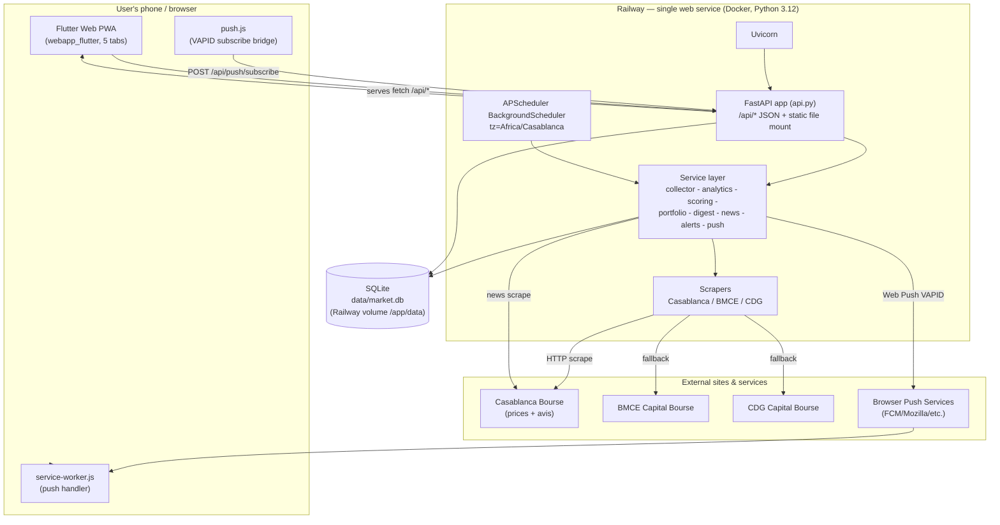

# Technical Handover — Bourse Casablanca (Moroccan Stock Intelligence Platform)

> Audience: an AI assistant / senior engineer taking over the project cold.
> Nothing here assumes prior exposure. Read sections 19 and 20 last — they contain the
> non-obvious reasoning and the decisions that are NOT visible in the code.

- **Repository:** `git@github.com:OussamaHm12/bourse-alerts.git` (GitHub: `OussamaHm12/bourse-alerts`)
- **Deploys from:** `main` branch
- **Live host:** Railway (single web service). Installed as a PWA on the owner's phone.
- **Working directory in this handover:** repo root `bourse/`
- **Primary language(s):** Python 3.12 (backend), Dart / Flutter (frontend, compiled to Flutter Web)
- **Legal framing (important, repeated in the UI):** market intelligence + notifications ONLY.
  It does **not** place trades, route orders, or give investment advice. Every digest ends with a
  disclaimer. Casablanca Bourse quotes are delayed ~15 min.

---

## 1. Project Overview

### What the application does
A personal Casablanca Stock Exchange (Bourse de Casablanca) intelligence platform. It:

1. **Scrapes** the Moroccan equities market (prices, variation, volume, market cap, day highs/lows)
   from the official Casablanca Bourse site, with two fallback broker sites.
2. **Stores** every snapshot indefinitely in a SQL database (history accumulates over time).
3. **Computes analytics**: momentum (1/5/30/90 d), moving averages (MA20/50/200), volatility,
   volume anomaly, relative performance vs market, support/resistance, drawdown, 52-week proximity,
   sector strength.
4. **Scores opportunities** 0–100 (BUY / WATCH / AVOID) with human-readable reasons and risks.
5. **Tracks a personal portfolio** (quantity + buy price per holding) and computes net P/L after
   fees, plus a **SELL / HOLD** recommendation per position.
6. **Collects official market news** (Casablanca Bourse "avis"/notices) and links them to symbols.
7. **Notifies** the owner through one channel: **Web Push** (PWA notifications on the phone),
   with every message also persisted to the in-app notifications inbox. A Telegram path existed
   until 2026-07-21; it was removed — the app is the only channel now.
8. **Serves a Flutter Web PWA** (installable app) and a JSON API from the same process.
9. A Streamlit dashboard existed until 2026-07-16; removed (never deployed, duplicated the
   scoring pipeline, and pulled streamlit+plotly — ~180 MB — into the production image).

### Main business goals
- Give the owner a **once-installed phone app** that shows portfolio value, per-stock SELL/HOLD
  advice, market movers, ranked buy opportunities, news, and a notification history.
- Push **timely alerts** at fixed times on trading days, plus an **urgent alert** when an owned
  stock crashes intraday.
- Be **cheap and self-contained**: one always-on container, SQLite, no external DB required.

### Target users
Effectively a **single-user / personal tool** (the owner). There is **no multi-user model, no login,
no per-user portfolios**. Any visitor to the URL sees the same (the owner's) portfolio and receives
the same pushes if they subscribe. This is a deliberate simplification, not a bug — but it is the
single most important architectural constraint to understand before adding users (see §6, §12, §17).

### Current development status
- **Live in production on Railway**, installed as a PWA, web push working (as of 2026-07-03 in
  the project memory; today's date in this handover is 2026-07-08).
- Actively iterated on the frontend (premium Material 3 redesign, charts, animations, a
  Notifications inbox) — see recent commits.
- Backend feature-complete for the personal use case.

### Features already completed
- Market scraping with multi-source fallback + dedup + resilient SSL retry.
- Full analytics + 3-way scoring with explanations.
- Portfolio net-P/L and SELL/HOLD engine (env-tunable thresholds).
- Official news scraping + sentiment/event classification + symbol linking.
- Web Push (VAPID) with subscription storage + stale-subscription cleanup.
- In-process APScheduler (bootstrap seed + weekday cron jobs).
- FastAPI JSON API (overview, stocks, stock detail, opportunities, news, notifications, sectors,
  health, push subscribe/test, run-now).
- Flutter Web PWA: 5 tabs (Portfolio, Market, Opportunities, News, Notifications) + per-stock
  detail sheet (price chart, score breakdown, indicators, linked news) + manual "run now" button.
- Notifications inbox (persisted `notifications` table shown in-app).
- Cache-busting via `no-cache` app-shell headers so new deploys load without a stale SW.
- ~~Streamlit dashboard~~ — removed 2026-07-16; the PWA covers it.

### Features still missing / not done
- **Authentication / multi-user / per-user portfolios** (none — see §6).
- **Alembic migrations** (schema is created with `create_all`; no migration history).
- **PostgreSQL in production** (supported by config/`psycopg`, but Railway runs SQLite on a volume).
- Backtesting, fundamentals/valuation ratios, sector benchmark indices.
- PDF text extraction for official notices (only titles/links are parsed).
- More news/RSS sources.
- Automated Flutter build in CI (the compiled web build is committed by hand — see §7, §14).
- Tests for the API layer, scrapers-against-fixtures beyond the two included, scheduler.

---

## 2. Architecture

### High-level shape
One Python process (FastAPI under Uvicorn) does **everything**: it serves the JSON API, serves the
pre-compiled Flutter Web PWA as static files, and runs an in-process APScheduler that collects data
and sends notifications on a cron. Data lives in SQLite on a mounted volume. It is the only
sender: the GitHub Actions cron that used to duplicate it is gone, and so is the Telegram path it
delivered on.

### Components
- **Frontend:** Flutter Web (single `main.dart`), compiled to `webapp_flutter/` and **committed** to
  the repo. Served as static files by FastAPI. Talks to the API on the **same origin** (relative
  URLs), so there is no CORS concern and no separate frontend host.
- **Backend:** FastAPI app (`moroccan_stock_intelligence/api.py`) + a rich service layer.
- **Scheduler:** APScheduler `BackgroundScheduler` started in the FastAPI lifespan
  (`ENABLE_SCHEDULER=true`), timezone `Africa/Casablanca`.
- **Database:** SQLite via SQLAlchemy 2.0 ORM (`sqlite:///data/market.db`). PostgreSQL supported by
  swapping `DATABASE_URL`.
- **Storage:** the SQLite file on a Railway volume mounted at `/app/data`. No object storage.
- **Auth:** none.
- **Third-party services:** Web Push endpoints (browser push services, outbound), scraped
  market/news websites (inbound data).
- **APIs (internal):** the `/api/*` JSON endpoints (see §9).
- **External integrations:** Casablanca Bourse (prices + avis), BMCE Capital Bourse, CDG Capital
  Bourse (price fallbacks), VAPID web push.

### Architecture diagram (Mermaid)



### Two runtime "modes" (know this)
1. **Server mode (`cli serve`)** — what Railway runs. FastAPI + static PWA + in-process scheduler.
   This is the only thing that notifies in production.
2. **CLI/batch mode (`cli <command>`)** — one-shot commands, for local dev and manual runs. The
   digest commands write to the inbox and send a web push; `run-once` is silent.

---

## 3. Flutter Project Structure

The Flutter app is intentionally tiny: **one Dart file** plus web shell assets. There is no
package-by-feature structure, no state-management library, no router package, no DI container. This
is deliberate (see §19). Treat `main.dart` as the whole app.

```
flutter_app/
├── lib/
│   └── main.dart            # THE ENTIRE APP (UI, API client, models-as-maps, theme)
├── web/
│   ├── index.html           # app shell; loads push.js + flutter_bootstrap.js
│   ├── push.js              # window.appEnablePush / appTestPush / appRunNow (VAPID + fetch)
│   ├── service-worker.js    # push + notificationclick handlers (NOT Flutter's SW)
│   ├── manifest.json        # PWA manifest (name, icons, standalone, portrait)
│   ├── favicon.png
│   └── icons/               # Icon-192/512 + maskable variants
├── pubspec.yaml             # deps: fl_chart, flutter_animate
├── pubspec.lock
├── analysis_options.yaml
├── README.md
└── .idea/ , .metadata , *.iml   # IDE files
```

> The **compiled output** of this app lives at repo-root `webapp_flutter/` and is what production
> serves. `flutter_app/` is the source; `flutter_app/build/` is gitignored. See §7/§14 for the
> (manual) rebuild workflow.

### State management
Plain `StatefulWidget` + `setState`. Each tab is its own `StatefulWidget` that fetches its data in
`initState` and holds it in local fields. No Provider/Riverpod/Bloc/GetX. The shell uses an
`IndexedStack` so tab state is preserved when switching tabs.

### Navigation
- Bottom `NavigationBar` with 5 destinations, index held in `_HomeShellState._idx`.
- Pages are `const [PortfolioPage(), MarketPage(), OppsPage(), NewsPage(), NotificationsPage()]`
  inside an `IndexedStack`.
- The per-stock **detail** view is a `showModalBottomSheet` + `DraggableScrollableSheet`
  (`showStockDetail(context, symbol)`), not a route.
- External news links open with `html.window.open(url, '_blank')`.

### Dependency injection
None. Functions are top-level (`api()`, `fmt()`, `badge()`, `glassCard()`, etc.). No service
locator.

### Models
There are **no typed model classes**. API responses are decoded with `jsonDecode` into
`Map<String,dynamic>` / `List` and read by key inline in widgets (e.g. `h['net_pl']`,
`s['buy_score']`). This is the biggest source of frontend fragility (see §12).

### Repositories / services (frontend)
Single function: `Future<dynamic> api(String path)` → resolves `path` against `Uri.base` and does an
`HttpRequest.getString` + `jsonDecode`. All GETs. Mutations go through the JS bridge (`push.js`) via
`js_interop`: `appEnablePush()`, `appTestPush()`, `appRunNow()`.

### UI organization
All widgets are in `main.dart`, grouped by comment banners: palette, api helpers, shell, portfolio,
market, opportunities, news, notifications, stock detail sheet, small helpers (`_scoreRing`, `_bar`,
`_mrow`, `_Skeleton`). Reusable helpers: `glassCard()`, `badge()`, `sectionTitle()`, and a
`.enter(i)` extension that applies a staggered fade/slide entrance animation.

### Themes
Dark-only Material 3. A hand-picked palette is defined as top-level `const Color` values
(`bg #0B1120`, `surface`, `surface2`, `line`, `text`, `muted`, `accent #38BDF8` cyan, `green`,
`red`, `amber`). `ColorScheme.fromSeed(seedColor: accent, brightness: dark)`. `InkSparkle` splash.
Cards use a subtle linear gradient (`glassCard`). Semantic colors: green = gain/ACHETER,
red = loss/ÉVITER, amber = SURVEILLER.

### Localization
**Hardcoded French** throughout (no `intl`/ARB). Number formatting is custom (space thousands
separator via regex in `fmt()`), matching French/Moroccan convention. Labels: ACHETER / SURVEILLER /
ÉVITER / NEUTRE; VENDRE / CONSERVER.

### Environment configuration
None in the Flutter layer — no `.env`, no build flavors. The app calls **relative** API paths so it
just works wherever it is served (same origin). All configuration is server-side.

---

## 4. Backend

### Framework & language
- **FastAPI 0.115** on **Uvicorn 0.34** (`uvicorn[standard]`), Python 3.12.
- **SQLAlchemy 2.0** ORM (typed `Mapped[...]` declarative models).
- **APScheduler 3.11** for scheduling.
- **BeautifulSoup4** + **requests** + **tenacity** for scraping.
- **pandas** for analytics.
- **pywebpush** + **py_vapid** + **cryptography** for web push.
- Packaged as a normal Python package `moroccan_stock_intelligence` with a CLI entrypoint.

### Architecture (layers)
```
api.py            FastAPI routes + static mount + app-shell cache middleware + lifespan(scheduler)
cli.py            argparse CLI: init-db, collect, analyze, *-digest, intraday-update,
                  watch-holdings, run-once, send-alerts, daily-summary, gen-vapid, serve
scheduler.py      APScheduler jobs (bootstrap, digest, intraday) + run_update_now
config.py         Settings dataclass, all env vars (frozen singleton `settings`)
db.py             engine/session factory, sqlite parent dir + connect_args, create_all
models.py         SQLAlchemy ORM tables
schemas.py        frozen dataclasses (StockSnapshot, NewsItem) — internal DTOs (NOT pydantic)
repository.py     DB read/write helpers + pandas price frame loader
logging_config.py JSON-line logging to stdout, UTC timestamps
utils.py          normalize_text, parse_number (Moroccan formats), clamp, pct_distance
scrapers/         base (retry/SSL), casablanca (primary), bmce, cdg (fallbacks)
services/         collector, analytics, scoring, portfolio, digest, news, alerts,
                  push, views
```

### Endpoints
See §9 for full detail. Summary: all read endpoints are `GET /api/*` and return plain dicts; three
`POST` endpoints handle push subscribe/test and the manual run trigger. Static PWA is mounted at `/`.

### Authentication / middleware
- **No authentication** on any endpoint.
- One custom middleware `_revalidate_app_shell`: adds `Cache-Control: no-cache, must-revalidate` to
  `/` and any `.html/.js/.json/.webmanifest` response, so browsers revalidate (ETag → fast 304)
  instead of serving a stale cached app shell after a deploy. This was added specifically to fix
  "new deploy doesn't show up" (commit `e242c3c`).
- **No CORS middleware** (not needed — same-origin). If you split the frontend to another host you
  must add `CORSMiddleware`.
- **No rate limiting.**

### Services / business logic
- **collector** — runs scrapers with source isolation (first source that returns rows wins),
  dedups by `(source, symbol)` keeping the most complete snapshot, persists.
- **analytics** — resamples each symbol to daily (`resample("1D").last()`), computes the full
  `MetricSet` per symbol; sector strength is a second pass (mean 30-day momentum per sector).
- **scoring** — weighted BUY score, plus WATCH and AVOID, with reasons/risks/components.
- **portfolio** — loads holdings (from `PORTFOLIO_JSON` env or `config/portfolio.json`), computes
  net P/L after fees, derives SELL/HOLD advice.
- **digest** — builds the rich HTML message (full digest + intraday update + urgent alert) and the
  short push payloads; `html_to_text` strips the markup for the in-app notifications inbox.
- **news** — scrapes official avis, classifies event/sentiment, links to symbols.
- **alerts** — dedups alerts once/symbol/day and dispatches urgent holding- and favorite-crash
  alerts as a web push plus an inbox entry.
- **push** — VAPID key gen, subscription save, `send_push_to_all` (prunes 404/410 endpoints).
- **views** — turns metrics/scores/portfolio into the JSON payloads the API returns.

### Database access
All through SQLAlchemy sessions created from a `sessionmaker` (`get_session_factory`). API routes
open a `with SessionFactory() as session:` per request. Analytics loads everything into a pandas
DataFrame via `load_price_frame`. `expire_on_commit=False`, `autoflush=False`.

---

## 5. Database

### Type
- **SQLite** in dev and in current production (`sqlite:///data/market.db`), file on a Railway volume.
- **PostgreSQL** is a supported drop-in via `DATABASE_URL=postgresql+psycopg://...`
  (`psycopg[binary]` is in requirements). Untested in production per the memory notes.
- SQLite connect args: `check_same_thread=False`, `timeout=30` (so a scheduled job and a manual
  `/api/run-now` can wait on a lock instead of erroring — SQLite is single-writer).

### Schema creation & migrations
- **No migrations / no Alembic.** Tables are created idempotently at startup with
  `Base.metadata.create_all(engine)` (called in `api.py` import and in `cli` commands).
- Consequence: **adding a column requires a manual migration or a fresh DB** — `create_all` never
  ALTERs existing tables. This is real technical debt (see §12/§19).

### Tables (from `models.py`)

**`stocks`** — one row per instrument.
| column | type | notes |
|---|---|---|
| id | int PK | |
| symbol | str(32) | **unique**, indexed |
| company_name | str(255) | indexed |
| sector | str(128) null | |
| source | str(64) null | which scraper last wrote it |
| source_url | text null | |
| created_at / updated_at | datetime(tz) | server defaults; `updated_at` onupdate |
- Relationship: `prices` (1-to-many).

**`prices`** — every market snapshot (history, kept indefinitely).
| column | type | notes |
|---|---|---|
| id | int PK | |
| stock_id | FK stocks.id | indexed |
| observed_at | datetime(tz) | indexed |
| current_price, daily_variation, volume, traded_quantity, market_cap, high_day, low_day | float null | |
| source | str(64) | |
| source_url | text null | |
| raw_payload | text null | JSON dump of raw scraped cells |
| created_at | datetime(tz) | |
- **Unique constraint** `uq_price_snapshot (stock_id, observed_at, source)` → idempotent snapshot
  writes (a re-run at the same timestamp won't duplicate).

**`signals`** — analytics events / score explanations (audit trail; also surfaced in digests).
| column | type | notes |
|---|---|---|
| id | int PK | |
| stock_id | FK | indexed |
| generated_at | datetime(tz) | indexed |
| signal_type | str(64) | indexed (price_crash, volume_spike, breakout, support_test, opportunity_score) |
| score | float null | |
| severity | str(32) | default "info" ("warning" for crashes) |
| explanation | text | |
| metrics_json | text null | full MetricSet dump |

**`alerts`** — de-duplicated alert events + their delivery state.
| column | type | notes |
|---|---|---|
| id | int PK | |
| stock_id | FK | indexed |
| created_at | datetime(tz) | |
| event_key | str(255) | indexed; e.g. `ATW-urgent-crash-2026-07-08` |
| alert_type | str(64) | indexed |
| message | text | rendered message |
| sent | int | 0/1 delivery flag |
- **Unique constraint** `uq_alert_event (stock_id, event_key)` → dedup once per symbol per event
  per day (the `event_key` embeds the date).

**`push_subscriptions`** — Web Push endpoints.
| column | type | notes |
|---|---|---|
| id | int PK | |
| endpoint | text | |
| p256dh | str(255) | client public key |
| auth | str(255) | client auth secret |
| created_at | datetime(tz) | |
- **Unique constraint** `uq_push_endpoint (endpoint)` (upserted on re-subscribe).
- **No user linkage** — a global list; every push goes to every subscriber.

**`notifications`** — persisted history of sent notifications (the in-app inbox).
| column | type | notes |
|---|---|---|
| id | int PK | |
| created_at | datetime(tz) | indexed |
| kind | str(32) | digest / intraday / test / urgent (default "digest") |
| title | str(255) | |
| body | text | plain-text (HTML stripped) |

**`news`** — official announcements.
| column | type | notes |
|---|---|---|
| id | int PK | |
| stock_id | FK null | linked symbol if matched |
| published_at | datetime(tz) null | |
| collected_at | datetime(tz) | |
| source | str(128) | |
| title | text | |
| url | text | |
| event_type | str(64) null | capital_action/dividend/results/trading_notice/announcement |
| sentiment | str(32) null | positive/negative/neutral |
| impact_score | float null | −1..1-ish |
- **Unique constraint** `uq_news_url (url)` → dedup by URL.

### Relationships summary
`stocks 1—* prices`, `stocks 1—* signals`, `stocks 1—* alerts`, `stocks 1—0..* news`
(news.stock_id nullable). `push_subscriptions` and `notifications` are standalone (no FKs).

### Indexes
Declared via `index=True` on: `stocks.symbol`, `stocks.company_name`, `prices.stock_id`,
`prices.observed_at`, `signals.stock_id`, `signals.generated_at`, `signals.signal_type`,
`alerts.stock_id`, `alerts.event_key`, `alerts.alert_type`, `news.stock_id`,
`notifications.created_at`. Plus unique-constraint indexes listed above.

---

## 6. Authentication

**There is no authentication, authorization, session, JWT, refresh token, password, role, or
permission system anywhere in this project.** This is intentional for a single-user personal tool.

- **Login / signup flow:** none.
- **Sessions / JWT / refresh tokens:** none.
- **Password reset:** none.
- **Permissions / roles:** none — every endpoint is public and unauthenticated.
- **"Identity" that does exist:**
  - **Web Push**: anyone who opens the site and taps "Activer" is stored in `push_subscriptions`
    and will receive **all** future pushes. There is no way to target one user.
  - **Portfolio**: a single global portfolio from `PORTFOLIO_JSON` (or `config/portfolio.json`).

**If you add multi-user:** you must add auth, per-user portfolios (currently the portfolio is
server-global config, not DB rows), and associate `push_subscriptions` with users. The README
roadmap explicitly lists "Role-based dashboard auth for hosted deployment" as future work.

---

## 7. Deployment

### The shipping model (read this carefully — it's non-obvious)
Production serves a **pre-compiled Flutter Web build that is committed to the repo** at
`webapp_flutter/` (~33 MB). The Dockerfile is a **simple single-stage Python image** — it does NOT
build Flutter. Reasoning (from project memory):
- Railway's builder **rejects BuildKit `--mount=type=secret`**, and the corporate network
  TLS-intercepts pub.dev/Docker Hub, so an in-image multi-stage Flutter build was abandoned.
- So: build Flutter locally (through a container), copy the output into `webapp_flutter/`, commit.
- `.dockerignore` excludes `flutter_app/` (source) from the image; `webapp_flutter/` ships.

`api._resolve_webapp_dir()` chooses what to serve: `WEBAPP_DIR` env override → else
`webapp_flutter/` if it exists → else legacy `webapp/` (hand-written vanilla PWA kept as a
local-dev fallback).

### Railway (production)
- **One service**, Docker runtime, built from `./Dockerfile`.
- **Start command** (Dockerfile `CMD`): `python -m moroccan_stock_intelligence.cli serve --host 0.0.0.0`
  — the port comes from `$PORT` (Railway injects it; `serve` reads `PORT` env, default 8000).
- **HTTPS** provided by Railway out of the box (required for PWA install + web push).
- **Volume**: single volume mounted at `/app/data` for SQLite persistence across deploys. Railway
  allows only one volume per service. A fresh/empty volume shows no data until the bootstrap seed
  job runs (~8 s after boot).
- **Scheduler**: `ENABLE_SCHEDULER=true` on this one instance so cron jobs fire once.
- **Always-on plan required**: free/trial Railway sleeps after ~15 min idle and would skip the
  scheduled pushes. Needs Hobby (~$5/mo).

### Render (alternate, `render.yaml` blueprint)
A ready Render blueprint exists: `type: web`, `runtime: docker`, `plan: starter` (always-on),
`healthCheckPath: /api/health`, a 1 GB disk at `/app/data`. Secrets set in dashboard
(`sync: false`): `VAPID_*`, `PORTFOLIO_JSON`. Not the primary host but kept working.

### Docker (local / VPS)
`docker-compose.yml` defines: `webapp` (the server), `collector` (one-shot `run-once`),
and an optional `postgres` profile. `.env` is the env source.

### GitHub Actions — REMOVED (2026-07-16). The double-notification risk is resolved.
`.github/workflows/stock-alert.yml` used to cron digests (10:00 / 16:00 Morocco) alongside the
Railway scheduler (09:00 / 17:00) — four digests a day. The deeper problem was not the duplication:
the workflow ran against a **throwaway SQLite file restored from the Actions cache**, so its history
depth, and therefore its momentum / scores / confidences, were structurally unrelated to
production's. The two channels could contradict each other about the same stock on the same day.

**Resolution: the deployed service is the only sender.** The workflow is deleted. Nothing other than
Railway may hold `VAPID_PRIVATE_KEY`. If a second scheduled runner is ever reintroduced, it gets a
read-only job and no notification secret — `tests/test_scheduler_jobs.py` enforces this.

### CI/CD
- **No build/test CI** beyond the scheduled workflow above. There is a `.pre-commit-config.yaml`
  for local hooks (ruff/black). Flutter is **not** built in CI.
- Railway `autoDeploy` on push to `main` (Render blueprint also `autoDeploy: true`).

### Secrets
Managed as host env vars (Railway/Render dashboard) and GitHub Actions repo secrets. Never
committed. `config/portfolio.json` and `.env` are gitignored; holdings are passed as
`PORTFOLIO_JSON`.

---

## 8. Environment Variables

All are read in `config.py` into the frozen `settings` singleton. Booleans parse common truthy/falsy
strings.

| Variable | Purpose | Example / default | Used in |
|---|---|---|---|
| `DATABASE_URL` | DB connection | `sqlite:///data/market.db` (default) / `postgresql+psycopg://...` | db.py |
| `HTTP_TIMEOUT_SECONDS` | Scrape/HTTP timeout | `20` | scrapers, news |
| `HTTP_RETRIES` | Scraper retry attempts (tenacity) | `3` | scrapers/base.py |
| `HTTP_VERIFY_SSL` | Verify TLS on scrapes | `true` | scrapers, news |
| `HTTP_ALLOW_INSECURE_SOURCE_RETRY` | Retry a source w/o SSL verify on cert error | `false` (prod), `true` in CI/Railway | scrapers, news |
| `LOG_LEVEL` | Logging level | `INFO` | logging_config |
| `MIN_OPPORTUNITY_SCORE` | BUY score to emit an `opportunity_score` alert | `80` | alerts.py |
| `OPPORTUNITY_RECAP_SCORE` | Threshold for the digest opportunity recap | `60` | digest.py |
| `PORTFOLIO_FILE` | Holdings file path | `config/portfolio.json` | portfolio.py |
| `PORTFOLIO_JSON` | Holdings as raw JSON (**secret**, overrides file) | `{"fee_rate":0.005,"holdings":[{"symbol":"ATW","quantity":10,"buy_price":410}]}` | portfolio.py |
| `TRADING_FEE_RATE` | Default round-trip sell fee | `0.005` (0.5%) | portfolio.py |
| `TAKE_PROFIT_PCT` | Take-profit trigger (with weak momentum) | `15` | portfolio._advise |
| `STOP_LOSS_PCT` | Stop-loss trigger | `-8` | portfolio._advise |
| `SELL_AVOID_SCORE` | AVOID score that forces SELL | `60` | portfolio._advise |
| `WEAK_MOMENTUM_PCT` | 30-day momentum considered "weakening" | `-3` | portfolio._advise |
| `URGENT_CRASH_PCT` | Intraday crash % for urgent alert (held stocks) | `-5` | alerts.dispatch_urgent_holding_alerts |
| `MOROCCO_UTC_OFFSET` | Offset for digest date/time labels (1, or 0 in Ramadan) | `1` | digest.py |
| `TIMEZONE` | Scheduler timezone | `Africa/Casablanca` | scheduler, api |
| `ENABLE_SCHEDULER` | Start in-process scheduler | `true` | api.lifespan |
| `VAPID_PUBLIC_KEY` | Web Push public key | (base64url) | api `/api/vapid-public-key`, push.js |
| `VAPID_PRIVATE_KEY` | Web Push private key (**secret**) | (base64url) | push.send_push_to_all |
| `VAPID_SUBJECT` | VAPID `sub` claim | `mailto:you@example.com` | push.py |
| `HOST` / `PORT` | serve bind (PORT injected by host) | `127.0.0.1` / `8000` | cli serve |
| `WEBAPP_DIR` | Override which static dir to serve | `webapp_flutter` | api._resolve_webapp_dir |

Generate VAPID keys with: `python -m moroccan_stock_intelligence.cli gen-vapid`.

---

## 9. API Documentation

Base: same origin as the PWA. All responses `application/json`. **No auth on any endpoint.**
Errors are FastAPI defaults (422 for bad query params, 404 where noted, 500 on unhandled).

### `GET /api/health`
- Purpose: liveness + scheduler flag. Auth: none.
- Response: `{"status":"ok","scheduler":true}`

### `GET /api/overview`
- Purpose: portfolio summary + market summary for the home tab.
- Response (shape):
```json
{
  "as_of": "2026-07-08T09:00:00+00:00",
  "timezone": "Africa/Casablanca",
  "portfolio": {
    "fee_rate": 0.005,
    "total_value": 12500.0,
    "total_net_pl": 480.25,
    "total_pl_pct": 4.0,
    "sell_count": 0,
    "holdings": [
      {"symbol":"ATW","company_name":"Attijariwafa","quantity":10,"buy_price":410.0,
       "current_price":425.0,"daily_variation":1.2,"market_value":4250.0,
       "net_pl":378.75,"net_pl_pct":9.2,"advice":"HOLD","advice_reason":"Tendance haussière intacte, conserver"}
    ]
  },
  "market": {
    "tracked": 78,
    "gainers": [{"symbol":"X","company_name":"…","price":100.0,"daily_variation":4.1}],
    "losers":  [{"symbol":"Y","company_name":"…","price":50.0,"daily_variation":-3.2}],
    "opportunities": [{"symbol":"Z","buy_score":62.0,"reasons":["…","…"]}]
  }
}
```
- Errors: 500 if DB unreadable.

### `GET /api/stocks?sort=&sector=&q=`
- Purpose: full market table with scores/labels.
- Params: `sort` ∈ `score|variation|volume|name` (default `score`); `sector` (exact, case-insensitive);
  `q` (substring match on symbol or company name).
- Response: `{"count":N,"sectors":[...],"stocks":[{symbol,company_name,sector,price,daily_variation,
  volume,volume_anomaly,momentum_30d,buy_score,watch_score,avoid_score,label,trend}]}`
  (`label` ∈ ACHETER/SURVEILLER/ÉVITER/NEUTRE; `trend` ∈ haussier/baissier/neutre).

### `GET /api/stock/{symbol}`
- Purpose: full per-stock detail for the bottom sheet.
- Response: metrics + `momentum{d1,d5,d30,d90}` + `moving_averages{ma20,ma50,ma200}` +
  volatility/relative perf/drawdown/support/resistance/52-week + `score{buy,watch,avoid,label,
  components{...},reasons[],risks[]}` + `history[{t,p}]` + `news[...]`.
- Errors: **404** `{"detail":"symbol not found"}` if the symbol has no metrics.

### `GET /api/opportunities?min_score=`
- Purpose: ranked BUY opportunities. `min_score` default 50 (the Flutter chips send 0/50/60/70).
- Response: `{"min_score":50.0,"count":N,"opportunities":[{symbol,company_name,price,
  daily_variation,buy_score,avoid_score,label,reasons[],components{},momentum_30d}]}`

### `GET /api/news?limit=` (default 30)
- Response: `{"news":[{title,url,source,published_at,event_type,sentiment,impact_score,symbol}]}`

### `GET /api/notifications?limit=` (default 50)
- Purpose: the in-app inbox (persisted digests/updates/alerts).
- Response: `{"notifications":[{id,created_at,kind,title,body}]}` (newest first).

### `GET /api/sectors`
- Response: `{"sectors":[{sector,avg_momentum_30d,count}]}` sorted by avg momentum desc.

### `GET /api/vapid-public-key`
- Response: `{"key":"<VAPID public key or null>"}` (null → the UI shows "Clé serveur manquante").

### `POST /api/push/subscribe`
- Body: a browser `PushSubscription` JSON (`{endpoint, keys:{p256dh, auth}}`).
- Effect: upsert into `push_subscriptions`. Response: `{"ok":true}`.
- Errors: raises `ValueError` (→ 500) if endpoint/keys missing.

### `POST /api/push/test`
- Effect: saves a `test` notification and pushes "Notification de test ✅" to all subscribers.
- Response: `{"sent": <count>}` (0 if no subscribers or no VAPID key).

### `POST /api/run-now`
- Effect: queues a **background** collect + analyze + news + notify run (same path as a scheduled
  digest; works any day incl. weekends). Returns immediately.
- Response: `{"queued": true}`. The push arrives and the overview refreshes ~30 s later.

### Static
`GET /` and all non-`/api` paths → served from `webapp_flutter/` (Flutter Web) with `no-cache`
revalidation headers on the shell files.

---

## 10. Flutter Screens

All in `flutter_app/lib/main.dart`. Shell = `HomeShell` (AppBar-less custom header + `NavigationBar`
+ `IndexedStack`). Currency is MAD; language French.

### 1) PortfolioPage ("Portefeuille") — `_PortfolioPageState`
- **Purpose:** notifications control card + portfolio value/P/L + per-holding cards with advice.
- **API:** `GET /api/overview` (`_load`). Manual actions via JS bridge: `appEnablePush()`,
  `appTestPush()`, `appRunNow()`.
- **Widgets:** `_notifCard` (Activer/Actualiser/Tester buttons + status text), `_summaryCard`
  (total value, net P/L, % badge, fee rate), `_holdingCard` (symbol, name, ACHETER/ÉVITER badge
  from `advice`, qty×price, net P/L, advice reason; taps open detail sheet), `_Skeleton` shimmer
  while loading.
- **State:** `_data` (overview map), `_error`, `_notif` (status string). `RefreshIndicator` re-loads.
- **Business logic:** "Actualiser" calls `appRunNow()`, waits ~33 s, reloads overview. Empty
  holdings → prompt to set `PORTFOLIO_JSON` server-side. Advice badge shows ÉVITER when `advice=='SELL'`.
- **Validations:** none (read-only + fire-and-forget actions).

### 2) MarketPage ("Marché") — `_MarketPageState`
- **Purpose:** searchable/sortable full market list.
- **API:** `GET /api/stocks?sort=&q=` on every search/sort change (`_load`).
- **Widgets:** search `TextField`, sort `DropdownButton` (Score/Variation/Volume/Nom),
  `ListView.builder` of `_stockRow` (trend icon+color, symbol/name, price, daily variation %,
  label badge, rounded buy score). Rows tap → detail sheet.
- **State:** `_stocks`, `_sort` (default `score`), `_q`, `_loading`.
- **Business logic:** trend arrow from `trend` field; label badge from `label`.

### 3) OppsPage ("Opportunités") — `_OppsPageState`
- **Purpose:** ranked buy opportunities with a min-score filter.
- **API:** `GET /api/opportunities?min_score=` (`_load`).
- **Widgets:** filter chips (Toutes/≥50/≥60/≥70), `ListView.builder` of `_oppCard`
  (`_scoreRing` circular score 0–100, symbol, label badge, daily variation, up to 2 reasons).
  Cards tap → detail sheet.
- **State:** `_opps`, `_min` (default 0), `_loading`.

### 4) NewsPage ("Actus") — `_NewsPageState`
- **Purpose:** official market news feed.
- **API:** `GET /api/news`.
- **Widgets:** `ListView.builder` of glass cards (title, source · symbol, open-in-new icon). Tap →
  `html.window.open(url)`.
- **State:** `_news`, `_loading`.

### 5) NotificationsPage ("Notifs") — `_NotificationsPageState`
- **Purpose:** in-app history of pushed notifications (inbox).
- **API:** `GET /api/notifications`.
- **Widgets:** empty-state (bell-off + schedule explanation), else `ListView.builder` of cards
  (kind icon, title, localized timestamp, body). Pull-to-refresh.
- **State:** `_items`, `_loading`. `_icon(kind)` maps digest/intraday/test/urgent → icons.
- **Note:** the empty-state copy says notifications arrive at "9h · 11h · 13h · 15h · 17h" — matches
  the in-process scheduler (see the schedule mismatch note in §12/§19).

### Stock detail sheet — `showStockDetail` / `_detailBody`
- **Purpose:** deep dive; opened from any stock/holding/opportunity tap.
- **API:** `GET /api/stock/{symbol}` inside a `FutureBuilder`.
- **Widgets:** header (symbol, name, label), big price + today's variation, `_priceChart`
  (fl_chart `LineChart` of `history`, green/red by direction, gradient fill; shows a placeholder if
  <2 points), score card (`_scoreCol` buy/watch/avoid + animated component `_bar`s), Atouts/Risques
  lists, technical indicators table (`_mrow`: momentum 5/30/90, MA20/50/200, volatility, volume
  anomaly, support/resistance, 52-week high/low).

---

## 11. Packages

### Flutter (pubspec.yaml)
| Package | Why |
|---|---|
| `flutter` (sdk) | Framework. |
| `fl_chart ^0.69.0` | Price line chart on the detail sheet + circular score rings. |
| `flutter_animate ^4.5.0` | Staggered card entrance animations, shimmer skeleton, animated bars. |
| `flutter_test` (dev) | Present but no tests written for the Flutter app. |
- **No package** for state, routing, DI, http, or i18n — done with SDK primitives:
  `dart:html` (HTTP + window + SW registration), `dart:js_interop` (bridge to `push.js`),
  `dart:convert`, `dart:math`. **This ties the app to Flutter Web** (`dart:html` won't compile for
  mobile/desktop — see §12/§19).

### Backend (requirements.txt)
| Package | Why |
|---|---|
| `fastapi` | Web framework / API + static serving. |
| `uvicorn[standard]` | ASGI server (`cli serve`). |
| `SQLAlchemy` | ORM / DB access. |
| `psycopg[binary]` | PostgreSQL driver (migration path). |
| `pandas` | Analytics (resampling, rolling stats, momentum). |
| `APScheduler` | In-process cron scheduler. |
| `beautifulsoup4` | HTML parsing for scrapers + news. |
| `requests` | HTTP client for scraping. |
| `tenacity` | Retry with exponential backoff on scraper fetches. |
| `pywebpush` | Send Web Push messages. |
| `py_vapid` (via pywebpush) + `cryptography` | VAPID key handling / key generation. |
| `python-dotenv` | Load `.env` into env for config. |
| `tzlocal` | Timezone resolution for APScheduler. |
| `pytest` | Tests. |
| `ruff`, `black`, `pre-commit` | Lint/format/hooks (dev). |

---

## 12. Current Problems

### Known bugs / inconsistencies
- **Schedule mismatch (documentation vs runtime):** the in-process scheduler
  (`scheduler.build_scheduler`) fires digests at **09:00 & 17:00** and intraday at **11/13/15**
  (weekdays). But the README, the GitHub Actions cron, and some code labels/copy say **10:00/16:00**
  and **12:00/14:00**. The Flutter empty-state says 9/11/13/15/17. Pick one story; right now the
  labels a user sees may not match when pushes actually arrive.
- **Untyped Flutter models:** everything is `Map<String,dynamic>` accessed by string key. A backend
  field rename silently breaks the UI (no compile-time safety). Some casts (e.g.
  `(o['buy_score'] as num).toDouble()`) will throw if a field is unexpectedly null.

### Limitations
- **Single global portfolio & single push audience** — not multi-user (see §6).
- **Flutter Web only** — `dart:html`/`js_interop` usage precludes building for Android/iOS/desktop
  without refactoring the API/push layers.
- **Sparse history flattens scores** — with only ~1 day of data, long-window momenta are null and
  most `buy_score`s cluster around ~49.5 (→ everything shows SURVEILLER). This self-corrects as the
  DB accumulates daily snapshots; it is expected, not a bug.
- **Scraper fragility** — parsers depend on the exact HTML of three third-party sites; a markup
  change breaks a source (fallbacks mitigate, and only 2 fixture tests exist).

### Technical debt
- **No migrations** — `create_all` only; schema changes need manual SQL or a DB reset.
- **Manual Flutter build + committed 33 MB build artifact** in `webapp_flutter/` (must remember to
  delete `canvaskit/*.symbols` and re-copy after every Dart change; easy to forget → stale UI).
- **Two frontends** in the repo (`webapp/` legacy vanilla PWA + `webapp_flutter/` Flutter build);
  the legacy one is a fallback but drifts from the Flutter feature set.
- **`analyze`/`overview` recompute everything from the full price frame on each call** — no caching
  at the API layer (FastAPI does not cache; `compute_state` runs per request — see
  AUDIT_TECHNIQUE.md §13).
- **No API tests, no scheduler tests.** Only parsing/scoring/portfolio unit tests.

### Scalability concerns
- **SQLite single-writer** — fine for one user; concurrent writers rely on a 30 s busy timeout.
  Multi-instance or heavy write load requires PostgreSQL.
- **`send_push_to_all` is synchronous & serial** — loops all subscriptions inside a request/job;
  fine for a handful, slow for many.
- **Full-table pandas load** grows unbounded (prices are never pruned). Eventually the per-request
  analytics cost and memory grow with history.
- **Single Railway volume / single instance** — no horizontal scaling; the scheduler must run on
  exactly one instance.

---

## 13. Future Improvements (prioritized)

1. **Resolve the schedule ambiguity.** Align the cron times, code labels, README, and Flutter copy
   to one source of truth.
2. **Add authentication + multi-user** if this is ever shared: per-user portfolios (move holdings to
   DB), associate `push_subscriptions` with users, protect `/api/run-now` and push endpoints.
3. **Typed Flutter models** (hand-written `fromJson` or `freezed`/`json_serializable`) to kill the
   `Map<String,dynamic>` fragility.
4. **Alembic migrations** so schema can evolve without data loss.
5. **Automate the Flutter build in CI** (build in a Flutter container, commit or publish the artifact)
   to remove the error-prone manual copy step.
6. **Cache analytics** (e.g. compute once per collection, store a materialized snapshot, or add a
   short TTL cache to the API) instead of recomputing from the full frame per request.
7. **Prune/aggregate old prices** (or move to Postgres + partitioning) to bound growth.
8. **Move push sending to async/background + batch**; prune stale subscriptions proactively.
9. **PostgreSQL in production** with the persistent-disk/volume already in place.
10. Roadmap items from README: backtesting, fundamentals/valuation, sector benchmark indices, PDF
    notice extraction, more news sources.

---

## 14. Development Workflow

### Run the backend locally
```bash
python -m pip install -r requirements.txt
python -m moroccan_stock_intelligence.cli init-db
python -m moroccan_stock_intelligence.cli run-once      # scrape+store+news+analyze (no notifications)
python -m moroccan_stock_intelligence.cli gen-vapid     # once: copy keys into .env
python -m moroccan_stock_intelligence.cli serve         # http://127.0.0.1:8000  (API + PWA + scheduler)
```
Windows: use `py -3 -m ...`. `http://localhost` is exempt from the HTTPS-required rule for push, so
you can test push locally.

### Useful CLI commands
`init-db, collect, analyze, run-once, morning-digest, afternoon-digest, intraday-update,
watch-holdings, daily-summary, gen-vapid, serve`. The digest/intraday/watch commands write to the
inbox and send a web push (need `VAPID_*`). `run-once` is safe (no messages).

### Build the Flutter frontend (manual — critical, from project memory)
Flutter tooling is **not** installed on the host; builds go through the
`ghcr.io/cirruslabs/flutter` container. Corporate network TLS-intercepts pub.dev, so a CA bundle
must be trusted inside the container.
1. Ensure Docker Desktop is running.
2. Export the Windows root store to `C:\tmp\winroot.pem` (PowerShell:
   `Get-ChildItem Cert:\LocalMachine\Root | ... > C:\tmp\winroot.pem`) and append it to the
   container's trust store (`SSL_CERT_FILE`).
3. In the container, mount `flutter_app/` and a **named** pub-cache volume
   (`-v bourse_pubcache:/root/.pub-cache`) so deps persist across `--rm` runs.
4. `flutter pub get` **then** `flutter build web --pwa-strategy=none`
   (the `--rm` container has an ephemeral pub-cache, so always `pub get` first).
5. `cp -r flutter_app/build/web/* webapp_flutter/`
6. Delete `webapp_flutter/canvaskit/*.symbols` (~6 MB unused debug symbols).
7. Commit `webapp_flutter/` (do **not** commit `flutter_app/build/`).
- `--pwa-strategy=none` is used so **our** `service-worker.js`/`push.js` control the PWA, not
  Flutter's generated SW.

### Deploy
Push to `main` → Railway auto-deploys the Docker image (serves the committed `webapp_flutter/`).
Set env vars in the Railway dashboard (`VAPID_*`, `ENABLE_SCHEDULER`, `TIMEZONE`,
`PORTFOLIO_JSON`, `AUTH_PASSWORD`). Ensure the `/app/data` volume exists for SQLite persistence.

### Testing
```bash
pytest            # tests/: parsing, scoring, portfolio
ruff check .
ruff format --check .
pre-commit install
```
Add saved-HTML fixtures whenever a scraped source changes shape.

### Debugging tips
- Logs are **JSON lines to stdout** (`logging_config.py`), UTC timestamps — grep by `msg` keys like
  `scraper_failed`, `digest_job_done`, `push_sent`, `bootstrap_done`.
- If the PWA shows "Clé serveur (VAPID) manquante" → `VAPID_PUBLIC_KEY` not set on the server.
- If a fresh deploy shows no data → the `/app/data` volume is empty; the `_bootstrap_job` seeds ~8 s
  after boot **only if** the prices table is empty. Or hit the "Actualiser" button (`/api/run-now`).
- If a new UI doesn't appear after deploy → stale SW/asset cache; the `no-cache` middleware fixes the
  shell, but confirm you actually re-copied `webapp_flutter/` from the new build.
- Weekend testing: scheduled jobs are weekday-only; use `/api/run-now` (the "Actualiser" button).

---

## 15. Repository Walkthrough (most important files)

- **`moroccan_stock_intelligence/api.py`** — FastAPI app: all routes, static PWA mount, app-shell
  `no-cache` middleware, lifespan that starts the scheduler. Entry for server mode.
- **`moroccan_stock_intelligence/cli.py`** — argparse CLI; every batch command + `serve` +
  `gen-vapid`. `run_analysis`/`run_digest`/`run_intraday_update` orchestrate collect→analyze→notify.
- **`moroccan_stock_intelligence/scheduler.py`** — APScheduler jobs: `_bootstrap_job` (seed if empty),
  `_digest_job` (open/close full digest), `_intraday_job` (light update + urgent crash), and
  `run_update_now` (manual button). **This file defines the real notification times (9/17 + 11/13/15).**
- **`moroccan_stock_intelligence/config.py`** — every env var → `settings` singleton. Start here to
  understand tunables.
- **`moroccan_stock_intelligence/models.py`** — SQLAlchemy tables (§5).
- **`moroccan_stock_intelligence/db.py`** — engine/session/create_all; SQLite dir + busy timeout.
- **`moroccan_stock_intelligence/repository.py`** — DB helpers (upsert stock, store snapshot/signal/
  news/notification, load history/news, `load_price_frame` for analytics).
- **`moroccan_stock_intelligence/services/analytics.py`** — pandas metric engine (`MetricSet`).
- **`moroccan_stock_intelligence/services/scoring.py`** — BUY/WATCH/AVOID scoring + reasons/risks.
- **`moroccan_stock_intelligence/services/portfolio.py`** — holdings loading, net-P/L, SELL/HOLD rules.
- **`moroccan_stock_intelligence/services/digest.py`** — message HTML + push payloads + urgent alert +
  `html_to_text`. Owns French date/number formatting and the disclaimer.
- **`moroccan_stock_intelligence/services/views.py`** — API payload builders + `classify_label` +
  `_trend` (the mapping from scores to ACHETER/SURVEILLER/ÉVITER/NEUTRE lives here).
- **`moroccan_stock_intelligence/services/collector.py`** — source-isolated scrape + dedup + persist.
- **`moroccan_stock_intelligence/services/news.py`** — official avis scraper + sentiment/event/symbol.
- **`moroccan_stock_intelligence/services/alerts.py`** — signal recording, alert dedup, urgent
  holding-crash dispatch, legacy per-event + daily summary builders.
- **`moroccan_stock_intelligence/services/push.py`** — VAPID gen, subscribe upsert, `send_push_to_all`
  with stale-endpoint pruning.
- **`moroccan_stock_intelligence/scrapers/{base,casablanca,bmce,cdg}.py`** — retry/SSL base + 3 sources.
- **`moroccan_stock_intelligence/utils.py`** — `parse_number` (Moroccan formats: spaces, comma
  decimals, K/M/B, %/MAD/DH), `normalize_text`, `clamp`, `pct_distance`.
- **`flutter_app/lib/main.dart`** — the entire Flutter app (§3, §10).
- **`flutter_app/web/{push.js,service-worker.js,index.html,manifest.json}`** — PWA shell + push bridge.
- **`webapp_flutter/`** — the committed compiled Flutter Web build served in production.
- **`webapp/`** — legacy hand-written vanilla-JS PWA (fallback; drifted from Flutter).
- **`Dockerfile`** — simple single-stage Python image; `CMD` = `cli serve --host 0.0.0.0`.
- **`render.yaml`** — Render blueprint (alternate host).
- **`docker-compose.yml`** — webapp/collector/dashboard/postgres services for local/VPS.
- **`services/backup.py`** — nightly verified DB snapshot, gzipped, kept on the local volume only.
- **`config/portfolio.example.json`** — sample config
  (`config/portfolio.json` is gitignored).
- **`tests/`** — `test_parsing.py`, `test_scoring.py`, `test_portfolio.py`.
- **`stock_alert.py`** — legacy thin wrapper that calls `cli.main()` (backward compatibility).
- **`README.md`** — thorough project docs (note the schedule discrepancy vs `scheduler.py`).

---

## 16. Business Rules

### Data collection
- Try sources in order **Casablanca → BMCE → CDG**; the first that returns rows wins (source
  isolation; a failing source is logged and skipped). If all fail → `RuntimeError`.
- Dedup snapshots by `(source, symbol)`, keeping the row with the most non-null fields.
- A price snapshot is idempotent per `(stock_id, observed_at, source)` — re-runs don't duplicate.

### Metrics (per symbol, on daily-resampled prices)
- Momentum over N days = % change from the last price at/before (latest − N days) to latest
  (needs enough history or returns null).
- MA20/50/200 = tail means; volatility_30d = std of daily returns × √252 × 100 (annualized %).
- volume_anomaly = latest volume ÷ 20-day average volume (zeros ignored).
- support/resistance = 90-day min/max; week52 high/low = 365-day max/min; distances are % from price.
- relative_performance_30d = symbol 30-day momentum − market mean 30-day momentum.
- sector_strength = mean 30-day momentum across the sector.

### Scoring (0–100)
- **BUY** = 0.25·momentum + 0.20·volume + 0.20·valuation + 0.15·support + 0.10·sector + 0.10·news.
  - momentum sub-score: weighted blend of 1/5/30/90-day momenta mapped through `clamp(50 + v·3)`
    (weights 0.15/0.25/0.35/0.25); defaults to 50 with no data.
  - volume = `clamp((volume_anomaly − 1)/2 · 100)`.
  - valuation = blend of "near 52-week low" (60%) and "below 52-week high" (40%).
  - support = `clamp(100 − |support_distance|·8)` (higher when price sits near support).
  - sector = `clamp(50 + sector_strength·2)`; news = `clamp(50 + news_sentiment·25)`
    (news sentiment currently defaults to 0 in scoring — see note below).
- **AVOID** adds points for: 5-day momentum < −5 (+25), 30-day < −10 (+25), drawdown < −25% (+20),
  high volume on a down day (+15), strongly negative news (+15); clamped 0–100.
- **WATCH** = `clamp(0.65·BUY + 0.35·(100 − AVOID))`.
- **Label** (`classify_label`): AVOID ≥ 60 → **ÉVITER**; else BUY ≥ 65 → **ACHETER**;
  else BUY ≥ 50 or WATCH ≥ 55 → **SURVEILLER**; else **NEUTRE**.
- **Trend** (`_trend`): price ≥ MA50·1.01 → haussier; ≤ MA50·0.99 → baissier; else neutre.
- Every score carries `reasons`, `risks`, and `components` (always non-empty — a neutral fallback
  reason/risk is inserted if none triggered).
- **Note:** `score_opportunity` accepts a `news_sentiment_score` but the pipeline calls it without
  one (defaults 0.0), so news does not currently move live scores even though news is collected.

### Portfolio & advice (per holding)
- cost_basis = buy_price × quantity; market_value = current_price × quantity.
- gross_pl = market_value − cost_basis; fees = market_value × fee_rate; **net_pl = gross_pl − fees**;
  net_pl_pct = net_pl / cost_basis × 100.
- **SELL** if any: net_pl_pct ≤ `STOP_LOSS_PCT` (−8), OR AVOID ≥ `SELL_AVOID_SCORE` (60), OR
  (net_pl_pct ≥ `TAKE_PROFIT_PCT` (15) AND 30-day momentum ≤ `WEAK_MOMENTUM_PCT` (−3)).
- Otherwise **HOLD** (with a reason: still in profit / trend intact / no clear sell signal).
- Missing price → HOLD, "no price available".

### Alerts / notifications
- Technical **signals** recorded every analysis: price_crash (≤ −5% daily), volume_spike (≥ 2×),
  breakout (near/at 52-week high with momentum), support_test (within 2% of support), and
  opportunity_score (BUY ≥ `MIN_OPPORTUNITY_SCORE` = 80). These are stored + surfaced in digests
  rather than each firing its own message.
- **Urgent alert** (immediate web push) fires only for **held** stocks that drop ≤ `URGENT_CRASH_PCT`
  (−5%) intraday, deduped once per symbol per day.
- **Digest opportunity recap** uses `OPPORTUNITY_RECAP_SCORE` (60): top pick detailed + Top 5.
- **Scheduler cadence (actual):** weekdays only — full digest at 09:00 & 17:00, intraday update at
  11/13/15; a one-off bootstrap seed ~8 s after boot if the DB is empty. Manual `/api/run-now`
  works any day.
- Delivery: digests/updates go out as a Web Push (short payload) and are saved to the
  `notifications` inbox; urgent alerts take the same route.

---

## 17. Security

### Authentication / authorization
- **None.** All `/api/*` endpoints and the PWA are public and unauthenticated (single-user design).
  `/api/run-now`, `/api/push/subscribe`, `/api/push/test` can be called by anyone who knows the URL.
  Adding auth is prerequisite to any multi-user or public exposure.

### Secrets management
- Secrets (`VAPID_PRIVATE_KEY`, `PORTFOLIO_JSON`) live only in host env vars
  (Railway/Render dashboards) and GitHub Actions secrets. `.env` and `config/portfolio.json` are
  gitignored. VAPID keys are generated via `gen-vapid` and pasted into the host env.

### Input validation
- FastAPI validates query/param types (e.g. `min_score: float`) → 422 on bad input.
- `save_subscription` validates the push payload has endpoint + keys.
- `parse_number` and `normalize_text` defensively parse scraped text.
- No user-supplied data is written to the DB except push subscriptions (from the browser) — low
  injection surface, and SQLAlchemy parameterizes queries.

### API protection / CORS / rate limiting
- **CORS:** none configured; safe today because the PWA is same-origin. Splitting hosts requires
  adding `CORSMiddleware`.
- **Rate limiting:** none. `/api/run-now` triggers a ~30 s scrape+notify; an unauthenticated
  attacker could spam it (DoS + notification spam). Consider a token or rate limit before any public
  exposure.
- **Transport:** HTTPS is provided by the host (Railway/Render); required for PWA + push.
- **Scraping hygiene:** browser-like headers, retries, timeouts; `HTTP_VERIFY_SSL=true` by default,
  with an explicit opt-in insecure retry (`HTTP_ALLOW_INSECURE_SOURCE_RETRY`) only for sources with
  broken cert chains — kept off in strict environments.

---

## 18. Performance

### Caching
- **Frontend/PWA:** app-shell files served with `Cache-Control: no-cache, must-revalidate` so
  browsers revalidate (fast 304) and always pick up new deploys; Flutter's own hashed assets cache
  normally. Our custom SW does not aggressively cache (push-only), avoiding stale-asset traps.
- **FastAPI:** **no response caching** — `overview`/`stocks`/`opportunities`/`stock` each recompute
  metrics from the full price frame per request (main optimization opportunity, §13).

### Optimization / lazy loading
- Flutter tabs use an `IndexedStack` and each fetches lazily in `initState`; the detail sheet loads
  on demand via `FutureBuilder`.
- Scrapers stop at the first successful source (no redundant fetches).

### Pagination
- **None.** List endpoints return the whole set (`limit` params exist for news/notifications, but
  stocks/opportunities are unbounded — acceptable at ~80 Moroccan equities).

### Image optimization
- Only static PWA icons (192/512 + maskable). No user images. CanvasKit `*.symbols` debug files are
  deleted from the shipped build to save ~6 MB.

### Database optimization
- Indexes on all FK/lookup/time columns and unique constraints for idempotency (§5). SQLite busy
  timeout (30 s) handles overlapping scheduler + manual runs. **No pruning/aggregation** of the
  ever-growing `prices` table yet (future work).

---

## 19. If You Were Continuing This Project (lead-dev notes)

**Mental model:** this is a **personal, single-user** market-intelligence app. Almost every
"missing" enterprise feature (auth, multi-tenant, migrations, caching) is absent **on purpose** to
keep it a one-container, one-SQLite-file, one-owner tool. Do not "fix" these by adding complexity
unless the goal actually changes to multi-user — if it does, they become prerequisites, not nice-to-haves.

**Hidden assumptions / decisions & their reasoning:**
- **The frontend ships as a committed compiled build (`webapp_flutter/`), not built in CI.** This is
  because Railway's builder rejects BuildKit secret mounts and the dev network TLS-intercepts
  pub.dev/Docker Hub, which broke in-image Flutter builds. So the proven path is: build locally in a
  Flutter container (with the corporate CA trusted + a persistent pub-cache volume), copy
  `build/web/*` into `webapp_flutter/`, delete `canvaskit/*.symbols`, commit. **If you edit
  `main.dart` and forget this, production won't change.** Automating this is the highest-value CI
  improvement.
- **`--pwa-strategy=none`** is deliberate: we want **our** `service-worker.js` (web-push handler)
  and `push.js` (VAPID subscribe) to own the PWA lifecycle, not Flutter's generated SW. Web push is
  implemented in JS and called from Dart via `js_interop` because that JS path was already proven —
  don't rewrite push in Dart.
- **`dart:html` + `js_interop` = Web-only.** The app cannot compile to native Android/iOS as-is.
  A future native port must replace `dart:html` HTTP with `package:http`/`dio`, replace the JS push
  bridge with `firebase_messaging`/native push, and add typed models.
- **One notification transport (Web Push) and one scheduler (in-process APScheduler).** Both the
  GitHub Actions cron and the Telegram transport have been removed; the Railway APScheduler is the
  sole sender. Keep it that way — a second scheduled runner notifying from its own database is the
  failure this project already lived through once.
- **The real schedule lives in `scheduler.py` (9/17 + 11/13/15, weekdays).** README/labels/GH-cron
  say 10/16 + 12/14. Treat `scheduler.py` as truth and reconcile the docs/labels.
- **Scores look "flat" early.** With little history, momenta are null and BUY clusters near ~49.5
  (SURVEILLER). This is by design and resolves as daily snapshots accumulate. Don't "tune" the model
  to fix a cold-start artifact.
- **The portfolio is global server config**, injected via `PORTFOLIO_JSON` (buy prices stay out of
  git). The whole API/PWA reflects the owner's portfolio. There is no per-request/per-user portfolio.
- **SQLite lives on one Railway volume at `/app/data`.** A fresh/empty volume shows nothing until the
  bootstrap seed (or the "Actualiser" button). Keep the scheduler on exactly one instance; don't
  scale to multiple instances without moving to Postgres + externalizing the scheduler.
- **`html_to_text`** exists so one composed message feeds both the push and the in-app inbox (plain).
- **Insecure SSL retry is opt-in per env**, not global — keep `HTTP_VERIFY_SSL=true` and only enable
  `HTTP_ALLOW_INSECURE_SOURCE_RETRY` where a specific source has a broken chain (CI/Railway).

**Coding conventions:**
- Python: `from __future__ import annotations`, type hints everywhere, `ruff` (E,F,I,UP,B) + `black`,
  line length 100, `E501` ignored. Frozen dataclasses for DTOs. JSON-line logging with snake_case
  `msg` keys (`event=value` style). Services are pure-ish functions taking a `Session`.
- Scheduled jobs **must never raise** (each `_*_job` wraps its body in try/except + `LOG.exception`)
  so the scheduler keeps running.
- Dart: single file, functional widget helpers, `const` colors, French UI strings, relative API
  paths, `setState` only.

**Pitfalls that will bite you:**
- Editing Dart without rebuilding/copying `webapp_flutter/` → no visible change in prod.
- Adding a model column and expecting it to appear → `create_all` won't ALTER; migrate or reset.
- Renaming a backend JSON field → silently breaks the untyped Flutter UI.
- Multiple instances or a second scheduler → duplicate pushes.
- Docker Desktop must be running to rebuild Flutter; the `--rm` container's pub-cache is ephemeral so
  always `pub get` before `build web` (or mount the named pub-cache volume).

---

## 20. Conversation History Summary (non-obvious context from prior work)

This captures decisions and history that are **not** derivable from the code alone (sourced from the
project's evolution and the deployment memory note). Chronology is approximate (see git log for
exact commits).

1. **Origin as a Telegram alert script.** The project began as `stock_alert.py` + a GitHub Actions
   workflow that sent Moroccan stock Telegram alerts. It was then rebuilt into the structured
   `moroccan_stock_intelligence` package ("Build Moroccan stock intelligence platform"). The GitHub
   Actions cron and `stock_alert.py` wrapper are **legacy** remnants kept for backward compatibility.

2. **Portfolio + twice-daily digests, then cadence changes.** Portfolio tracking (net P/L after
   fees) and SELL/HOLD advice were added with twice-daily digests. Digest timing was tuned several
   times (10:07/15:07 "off-peak minute" to dodge GitHub cron delays; then 4×/day; then, in the
   in-process scheduler, **every 2h on weekdays 09:00–17:00**). The user explicitly chose the
   "every 2h on weekdays" cadence. **Because timing was changed in several places at different
   times, the README/labels/GH-cron and the actual `scheduler.py` cron drifted apart — reconcile
   them.**

3. **Move from GitHub Actions to an always-on server.** To get reliable, exact-time notifications
   (GitHub delays top-of-hour crons, and free plans sleep), the project added a **FastAPI server +
   in-process APScheduler + Web Push PWA** so one always-on process replaces the cron. The GitHub
   Actions path was initially **kept as an alternate**, which was the root of the double-Telegram
   caveat. Both are resolved now: the workflow was deleted in 2026-07-16 and Telegram itself was
   removed in 2026-07-21, leaving web push as the only channel.

4. **PWA reliability fights.** Several commits address stale caching: versioned asset URLs, then a
   network-first shell + auto-reload on SW change, then finally the server-side `no-cache` app-shell
   middleware (`e242c3c`). The lesson learned: the reliable fix was **server headers**, not SW
   tricks. The custom SW is intentionally push-only (doesn't aggressively cache).

5. **Bootstrap seeding + manual run.** Because a fresh Railway deploy/volume starts empty and cron
   is weekday-only, `_bootstrap_job` seeds the DB ~8 s after boot if empty (verified: ~80 symbols),
   and `POST /api/run-now` (the "Actualiser"/"Lancer une mise à jour" button) lets the owner force a
   collect+analyze+notify any day, including weekends. These exist specifically to solve "empty app
   on first load" and "can't test on weekends."

6. **Deployment landed on Railway.** Repo `OussamaHm12/bourse-alerts`, deploys from `main`. Key
   fixes that made it work: `serve` binds to `$PORT` (Railway injects it; Dockerfile stopped
   hardcoding 8000); required env vars `VAPID_PUBLIC_KEY/PRIVATE_KEY/SUBJECT` (without them the PWA
   shows "Clé serveur (VAPID) manquante"), `ENABLE_SCHEDULER=true`, `TIMEZONE=Africa/Casablanca`,
   `PORTFOLIO_JSON` (holdings, since the file is gitignored). A single volume at `/app/data` holds
   SQLite (Railway allows one volume/service). `render.yaml` exists as a Render alternative with a
   persistent disk. **Known real holding referenced in memory: LBV, qty 2 @ 3840** (illustrates the
   portfolio format; the live value comes from `PORTFOLIO_JSON`).

7. **Frontend migration to Flutter Web (commit `2a828d7`, 2026-07-03).** The front end was switched
   from a **hand-written vanilla-JS PWA** (`webapp/`, still present as a fallback) to **Flutter Web**
   on the **same** Railway Docker deploy. `flutter_app/` is the Dart source.

8. **The build-and-ship saga (important).** First attempt: a multi-stage Dockerfile that builds
   Flutter in-image. This failed twice: (a) the corporate network TLS-intercepts pub.dev/pypi so
   `flutter pub get`/`pip` failed in-container — worked around locally by trusting the exported
   Windows root store via a BuildKit `--mount=type=secret`; but (b) **Railway's builder rejects
   `--mount=type=secret`** and the `# syntax=` frontend fetch from Docker Hub is TLS-blocked locally.
   **Final decision (commit `2c07a97`): abandon in-image Flutter builds. Commit the compiled
   `webapp_flutter/` (~33 MB) and serve it with the original simple single-stage Python Dockerfile.**
   `.dockerignore` excludes `flutter_app/` source; `webapp_flutter/` ships. Flutter tooling is not
   installed on the host — all builds go through the `ghcr.io/cirruslabs/flutter` image.

9. **Rebuild workflow (must-remember).** After editing Dart: run the cirruslabs/flutter container
   (mount `flutter_app/` + the `C:\tmp` certs, append `winroot.pem` to the trust store, mount a named
   `bourse_pubcache` volume, `flutter pub get` then `flutter build web --pwa-strategy=none`), copy
   `build/web/*` into `webapp_flutter/`, delete `canvaskit/*.symbols` (~6 MB), and commit. Do **not**
   commit `flutter_app/build/`. Docker Desktop tends to stop on its own and must be running.

10. **Multi-tab feature build (commit `6a3923c`).** The PWA gained 4 tabs (Portefeuille, Marché,
    Opportunités, Actus) + the per-stock detail sheet, backed by new read APIs (`/api/stocks`,
    `/api/stock/{symbol}`, `/api/opportunities`, `/api/news`, `/api/sectors`). Score reasons/risks
    were localized to French and `classify_label()` maps scores to ACHETER/SURVEILLER/ÉVITER/NEUTRE.
    A 5th tab (**Notifs**, in-app inbox backed by the `notifications` table) was added later
    (commit `91c97cc`).

11. **Premium redesign (commit `a250bf6`).** Added **fl_chart** (detail-sheet price line chart +
    score rings) and **flutter_animate** (staggered entrances, shimmer). These are real pub.dev deps,
    which is fine because local builds reach pub.dev through the trusted CA. Rebuild gotcha reiterated:
    ephemeral pub-cache in `--rm` containers → always `pub get` first + mount the named pub-cache
    volume.

12. **Cold-start scoring note (explicitly flagged as "not a bug").** With ~1 day of history, all
    `buy_score`s sit ~49.5 (SURVEILLER) and momentum is null; this differentiates as the DB
    accumulates daily snapshots. Don't chase this as a bug or over-tune the model.

13. **Open reliability items still not confirmed done (as of the memory note):**
    - **Always-on plan:** free/trial Railway sleeps after ~15 min and skips scheduled pushes → needs
      the Hobby (~$5/mo) plan.
    - **Volume:** confirm the `/app/data` SQLite volume is actually attached in the Railway UI (it's
      created via right-click on the canvas / Ctrl+K, not under Settings).

**Net:** the code is in good shape for its single-user purpose. The three things most likely to trip
up the next developer are (1) the **manual Flutter build-and-commit** step, (2) the
**schedule-time drift** between docs and `scheduler.py`, and (3) the **single-global-portfolio**
assumption. Address those
framings first and the rest of the codebase is straightforward.
